# CHOCCY

## 介绍
基于NumPy构建的启发式优化器<br>
Chen's Heuristic Optimizer Constructed with Core numpY

## 项目说明
本项目是一个完全免费且开源的启发式优化器，致力于打造一个简单易用、绘图形式丰富且便于进行算法分析的启发式优化器框架。
本项目提供了大量启发式算法的实现细节，支持对`实数`、`整数`、`序列`、`标签`以及`混合`类型等问题的优化，
旨在为对优化领域感兴趣的伙伴们提供易于理解的算法学习资源和有力的研究支持。<br>
另外，本项目希望为学习、竞赛和科研等领域的伙伴提供高效易用的优化工具。
无论是初学者还是资深研究者，都能借助它快速设计和优化问题，并获得满意结果。
同时，强大的可视化功能可将结果转化为直观图表，方便用于论文撰写和报告制作，助力在学术与实践中取得优异成果。
<br>`本代码仅供参考学习、竞赛和科学研究等非商业用途，在复制核心代码时请注明出处`

## 安装教程

1. 建议使用 `Anaconda` 创建 `Python` 环境<br>
使用 Anaconda 创建环境可以方便地管理依赖包，避免版本冲突，下载地址：[Anaconda所有版本](https://repo.anaconda.com/archive/)。
2. 安装必要包
本项目依赖以下包: `python>=3.6`、`numpy`、`scipy`、`matplotlib`。运行以下命令一键安装：<br>
```bash
pip install numpy scipy matplotlib
```

## 项目结构
```
CHOCCY/
├── Algorithms/                 # 算法集——优化器核心
│   ├── Multi/                  # 多目标优化算法
│   │   ├── MOEAD.py            # 基于分解的经典进化算法
│   │   ├── NNDREA.py           # 特殊二进制问题进化算法
│   │   └── NSGAII.py           # 经典多目标进化算法
│   ├── Single/                 # 单目标优化算法
│   │   ├── ACO.py              # 蚁群算法(TSP)
│   │   ├── DE.py               # 差分进化算法(实数)
│   │   ├── DP_KP.py            # 动态规划算法(KP)
│   │   ├── FI.py               # 最远插入算法(TSP)
│   │   ├── GA.py               # 遗传算法
│   │   ├── GFLS.py             # 引导快速局部搜索算法(TSP)
│   │   ├── Greedy_KP.py        # 贪婪算法(KP)
│   │   ├── HGA_TSP.py          # 混合启发式遗传算法(TSP)
│   │   ├── NNDREAS.py          # 特殊二进制问题算法(单目标)
│   │   ├── PSO.py              # 粒子群算法(实数)
│   │   └── SA.py               # 模拟退火算法
│   ├── Utility/                # 工具和功能函数
│   │   ├── Crossovers.py       # 交叉函数
│   │   ├── Educations.py       # 教育函数
│   │   ├── Mutations.py        # 变异函数
│   │   ├── Operators.py        # 算子函数(整合)
│   │   ├── Plots.py            # 绘图函数
│   │   ├── Selections.py       # 选择函数
│   │   └── Utils.py            # 各种工具函数
│   ├── ALGORITHM               # 算法函数父类
│   └── CONTRAST.py             # 算法对比封装函数
├── Datasets/                   # 数据集
│   ├── Multi/                  # 多目标问题数据集
│   └── Single/                 # 单目标问题数据集
├── Metrics/                    # 评价指标函数
│   └── Hypervolume.py          # 超体积指标
├── Problems/                   # 问题集
│   ├── Multi/                  # 多目标问题集
│   └── Single/                 # 单目标问题集
│   └── PROBLEM.py              # 问题父类
├── Run/                        # 算法优化问题实例
│   ├── Multi/                  # 多目标问题的优化实例
│   │   ├── Run_MOEAD.py        # 运行MOEA/D算法实例
│   │   ├── Run_NNDREA.py       # 运行NNDREA算法实例
│   │   ├── Run_NSGAII.py       # 运行NSGAII算法实例
│   │   ├── Solve_MOKP.py       # 多种算法求解MOKP问题对比实例
│   │   └── Solve_MoReal.py     # 多种算法求解多目标实数问题对比实例
│   └── Single/                 # 单目标问题的优化实例
│   │   ├── Run_GA.py           # 运行遗传算法实例
│   │   ├── Run_SA.py           # 运行模拟退火算法实例
│   │   ├── Solve_KP.py         # 多种算法求解KP问题对比实例
│   │   ├── Solve_Real.py       # 多种算法求解实数问题对比实例
│   │   └── Solve_TSP.py        # 多种算法求解TSP问题对比实例
└── README.md                   # 项目文档
```

PS: 项目中包含本人研究工作：<br>
Neural Network-Based Dimensionality Reduction for Large-Scale Binary Optimization with Millions of Variables (NNDREA), IEEE Transactions on Evolutionary Computation <br>
原文下载地址：[IEEE xplore](https://ieeexplore.ieee.org/abstract/document/10530207) / [ResearchGate](https://www.researchgate.net/publication/380393707_Neural_Network-Based_Dimensionality_Reduction_for_Large-Scale_Binary_Optimization_with_Millions_of_Variables#:~:text=In%20this%20paper,%20we%20propose%20a%20dimensionality%20reduction%20method%20to) (免费下载)


## 使用指南

### 快速开始

这里是快速开始

## 效果展示
### 单目标问题

- GA Solve Ackley (num_dec = 1) and GA Solve Ackley (num_dec = 2): <br>
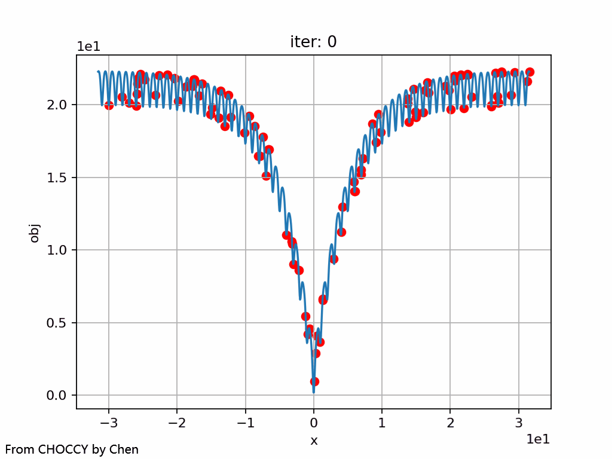 <br/>

- GA Solve Ackley (num_dec = 2)(3D) and GA Solve Ackley (num_dec = 10): <br>
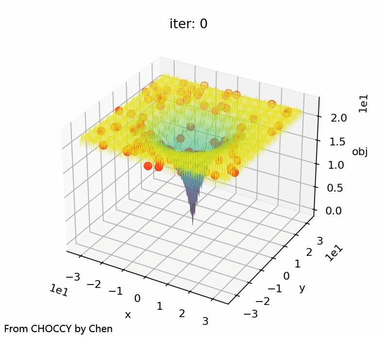 <br/>

- GA Solve TSP (30) and Solve MixFixLabelCluster (120, cluster = 3): <br>
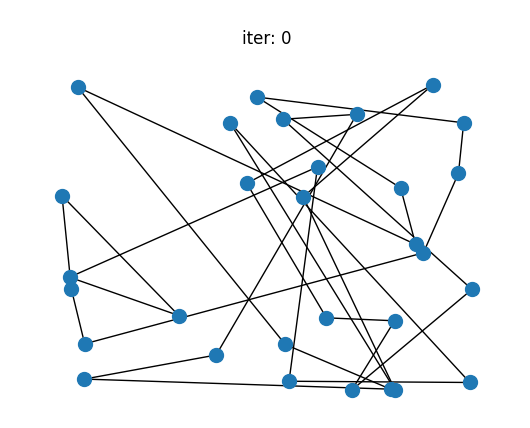 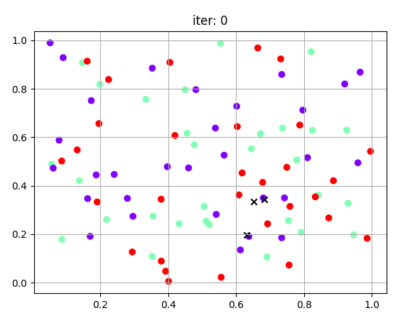<br/>

### 多目标问题

- NSGA-II Solve ZDT1 (num_dec = 30) and Solve ZDT3 (num_obj = 30) : <br>
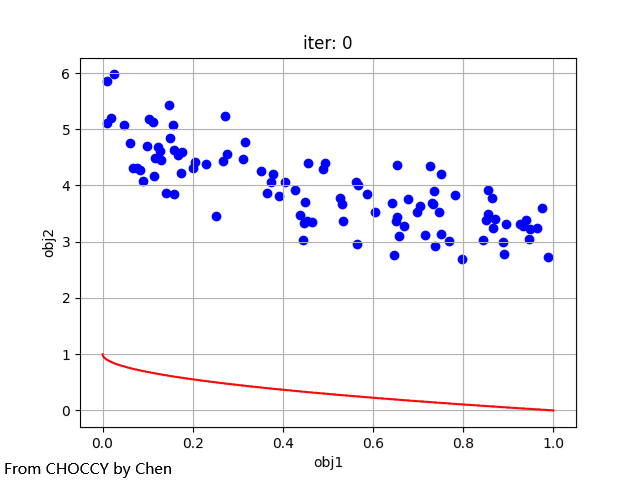 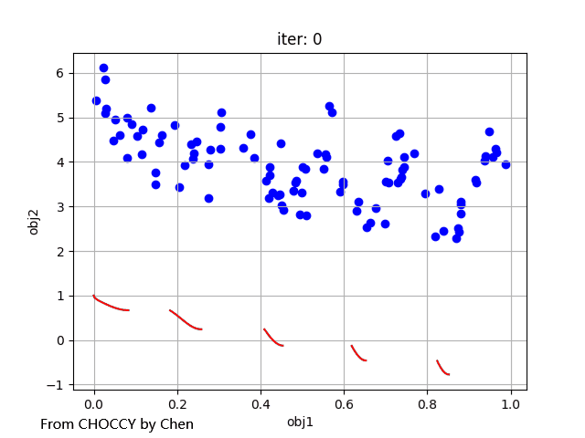<br/>

- NSGA-II Solve DTLZ1 (num_dec = 7) and Solve DTLZ2 (num_obj = 12) : <br>
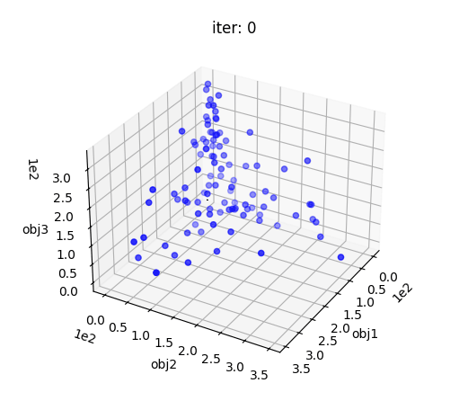 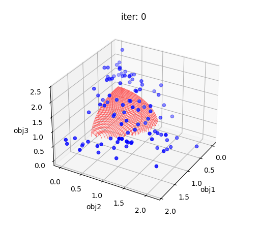<br/>

- MOEA/D Solve DTLZ1 (num_dec = 7) and Solve DTLZ2 (num_obj = 12) : <br>
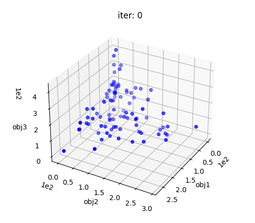 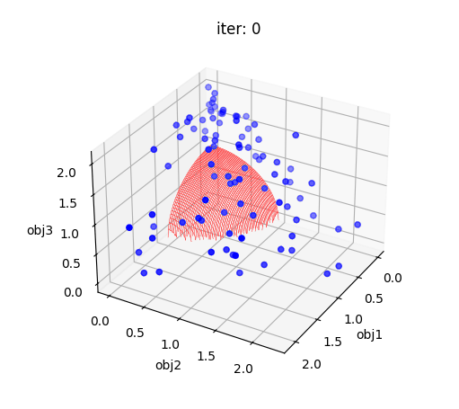<br/>

- Comparison of the performance of NSGA-II and NNDREA for MOKP-10000: <br>
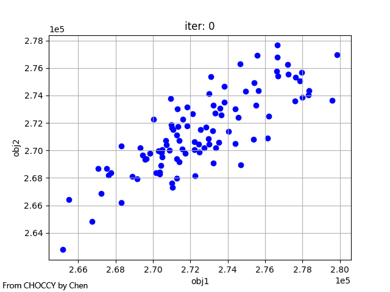 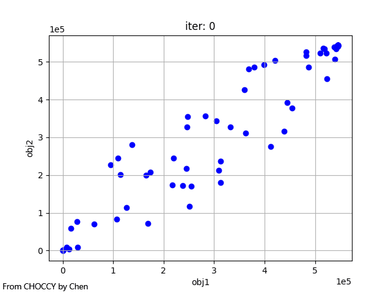<br/>

- Comparison of HV performance between NSGA-II and NNDREA for MOKP-10000: <br>
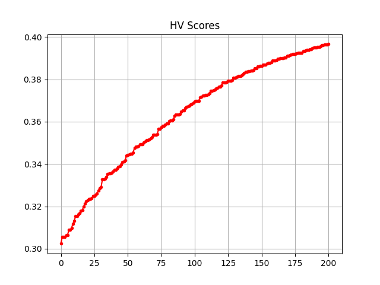 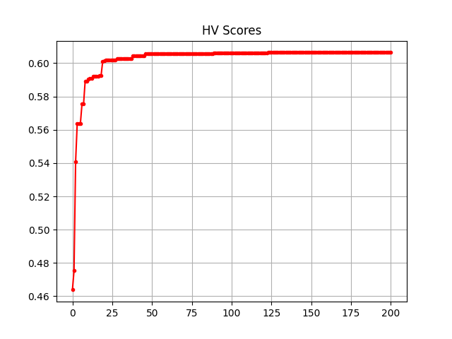<br/>

- Comparison of the performance of NSGA-II and NNDREA for MOKP-100000: <br>
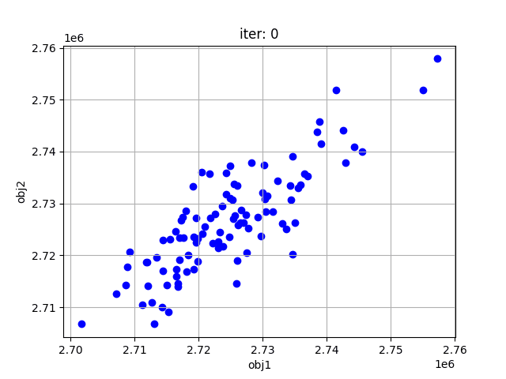 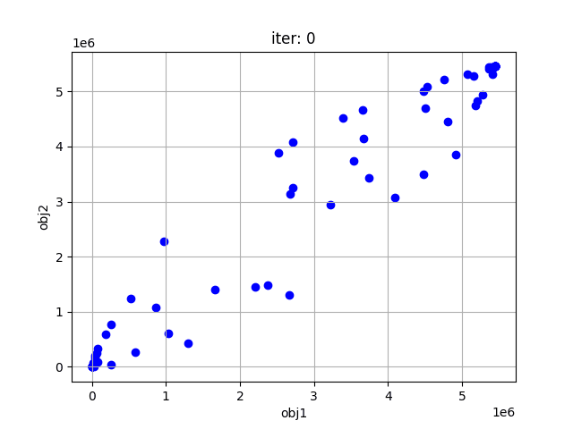<br/>

- Comparison of HV performance between NSGA-II and NNDREA for MOKP-100000: <br>
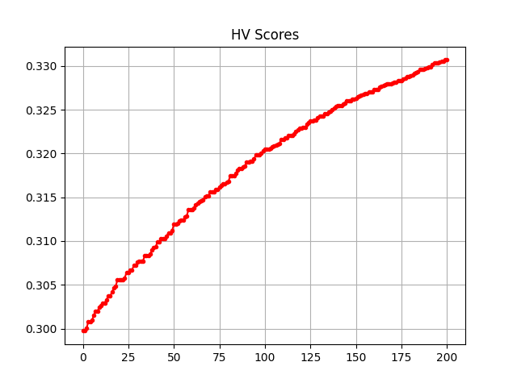 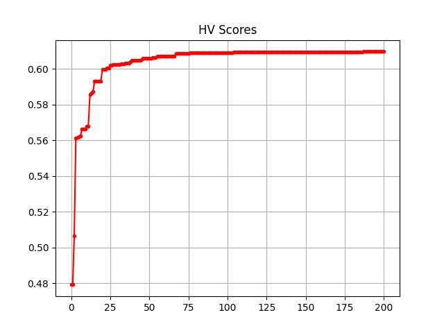<br/>
(PS: 可以看到即使问题扩大十倍，NNDREA的效果依然不变，仍然是收敛快且效果好)

## 参与贡献

Luchen Wang


