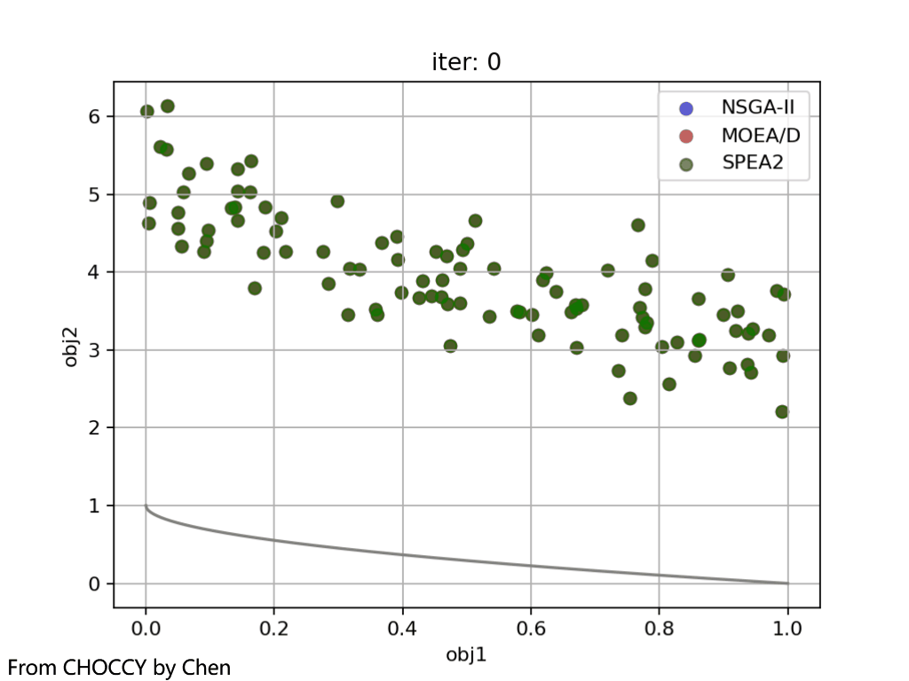
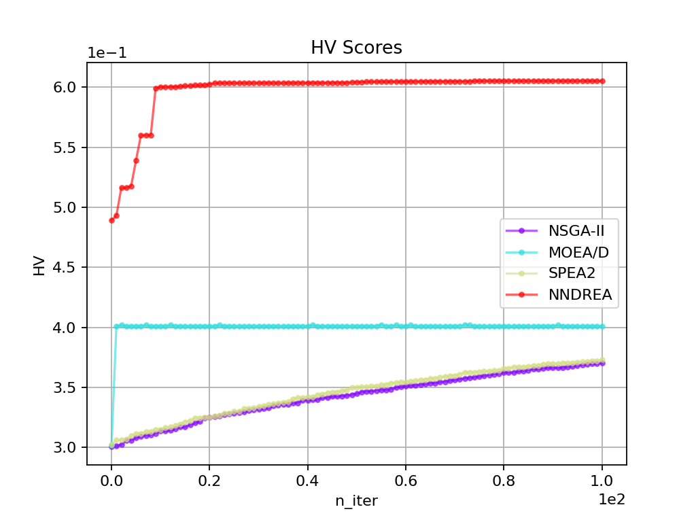

# 🍪 CHOCCY

基于NumPy构建的启发式优化求解器<br>
Chen's Heuristic Optimizer Constructed with Core numpY

## 🔖 项目简介

本项目是一个完全免费且开源的启发式优化求解器，致力于打造一个简单易用、绘图功能丰富、便于算法分析且扩展性强的优化框架。
本项目提供了大量启发式/元启发式算法的实现细节，支持对`实数`、`整数`、`序列`、`(固定)标签`以及`混合`类型问题的优化，
旨在为对优化领域感兴趣的伙伴们提供易于理解的算法学习资源和有力的研究支持💪。<br>
另外，本项目希望为学习、竞赛和科研等领域的伙伴提供高效易用的优化工具。
无论是初学者还是资深研究者，都能借助它快速设计和优化问题，并获得满意结果。
同时，不错的可视化功能可将结果转化为直观图表，方便用于论文撰写和报告制作，助力在学术与实践中取得优异成果🎉。
<br><br>
**特别说明：`本代码仅供参考学习、竞赛和科学研究等非商业用途，在复制核心代码时请注明出处`**

## 🌟 主要特性

- 🌍 支持多种`启发式`和`元启发式`优化算法，适用于广泛的问题类型求解
- 🚀 支持对多种问题的优化，包括但不限于`实数`、`整数`、`序列`、`(固定)标签`问题
- 🧩 支持对混合问题的优化，即问题的不同部分可以是不同类型的“混合”问题
- 🛠️ 提供了丰富的性能评估指标和优化算子及函数，可扩展性强
- 📉 支持对多种算法的实时优化比较，并提供丰富的可视化功能
- 📊 支持多种算法对多类问题的优化和求解，并对结果进行比较和可视化
- ⚡ 使用矩阵操作和`numba`的即时编译对核心部分进行优化，显著提高优化速度 

## 🎯 实现算法

- 🧬 遗传(进化)算法
- 🔥 模拟退火算法
- 🔗 差分进化算法
- 🐜 蚁群优化算法
- 🌟 粒子群优化算法
- ⚖️ 多目标优化算法
- 🔍 局部搜索相关算法
- 🚚 路由优化相关算法
- 📝 其他参见[实现清单](./References/IMPLES.md)

## 📚 安装教程

**详细的安装与使用教程请参见[使用指南](./References/GUIDE.md)** 🔥🔥🔥

**1. 建议使用 `Anaconda` 创建 `Python` 环境**

  使用 Anaconda 创建环境可以方便地管理依赖包，避免版本冲突。建议从 [Anaconda 官网](https://www.anaconda.com/download/success) 下载并安装 Anaconda。如果需要特定版本，可以访问 [Anaconda所有版本下载地址](https://repo.anaconda.com/archive/)。
  
  安装完成后，运行以下命令创建 Python 环境：
  
  ```bash
  conda create --name my_env python=3.9
  conda activate my_env
  ```
  **注意**：本项目支持 Python 3.7 及以上版本，建议使用 Python 3.9 以获得最佳兼容性。

**2. 安装必要包**

  本项目依赖以下包: `numpy`、`scipy`、`matplotlib`、`seaborn`、`tqdm`、`networkx`。请确保已安装 Python 3.7 或更高版本，运行以下命令一键安装必要包：
  
  ```bash
  pip install numpy scipy matplotlib seaborn tqdm networkx
  ```
  
**3. 安装可选包**

  本项目支持通过`numba`进行加速优化。为了体验更快的运行和优化速度，建议安装 `numba` 和 `tbb`。安装命令如下：
  ```bash
  pip install numba tbb
  ```

**4. 镜像源选择**

  如果在运行安装命令时发现下载速度较慢，可以尝试使用清华大学的镜像源进行安装。安装命令如下：
  ```bash
  pip install numpy scipy matplotlib seaborn tqdm networkx numba tbb -i https://pypi.tuna.tsinghua.edu.cn/simple
  ```
  注意：如果无法访问上述镜像源，也可以选择其他可用的镜像源，例如中国科技大学、阿里云等。

## 📦 项目结构

```
CHOCCY/
├── Algorithms/                 # 算法集——优化器核心
│   ├── Multi/                  # 多目标优化算法
│   │   ├── __init__.py         # 包初始化文件
│   │   ├── MOEAD.py            # 基于分解的经典进化算法
│   │   ├── NNDREA.py           # 特殊二进制问题进化算法
│   │   ├── NSGAII.py           # 经典多目标进化算法
│   │   └── ...                 # 其他算法(详见IMPLES清单)
│   ├── Single/                 # 单目标优化算法
│   │   ├── __init__.py         # 包初始化文件
│   │   ├── ACO.py              # 蚁群算法(TSP)
│   │   ├── DE.py               # 差分进化算法(实数)
│   │   ├── GA.py               # 遗传算法(进化算法)
│   │   ├── GFLS.py             # 引导快速局部搜索算法(TSP)
│   │   ├── Greedy_KP.py        # 贪婪算法(KP)
│   │   ├── HGA_TSP.py          # 混合启发式遗传算法(TSP)
│   │   ├── NNDREAS.py          # 特殊二进制问题算法(单目标)
│   │   ├── PSO.py              # 粒子群算法(实数)
│   │   ├── SA.py               # 模拟退火算法
│   │   └── ...                 # 其他算法(详见IMPLES清单)
│   ├── Utility/                # 工具和功能函数
│   │   ├── Crossovers.py       # 交叉算子函数
│   │   ├── Educations.py       # 教育算子函数
│   │   ├── Mutations.py        # 变异算子函数
│   │   ├── Operators.py        # 算子函数(整合)
│   │   ├── PerfMetrics.py      # 评价指标函数
│   │   ├── PlotUtils.py        # 绘图工具函数
│   │   ├── ReadUtils.py        # 读取文件工具函数
│   │   ├── RecordUtils.py      # 记录信息工具函数
│   │   ├── SaveUtils.py        # 保存文件工具函数
│   │   ├── Selections.py       # 选择算子函数
│   │   └── SupportUtils.py     # 算法支持相关函数
│   ├── __init__.py             # 包初始化文件
│   ├── ALGORITHM               # 算法函数父类
│   ├── Comparator.py           # 算法比较器封装类
│   └── Evaluator.py            # 算法评估器封装类
├── Datasets/                   # 数据集
│   ├── Multi/                  # 多目标问题数据集
│   └── Single/                 # 单目标问题数据集
├── Outputs/                    # 输出结果集
│   ├── Logs/                   # 日志输出结果
│   ├── Multi/                  # 多目标问题输出结果
│   └── Single/                 # 单目标问题输出结果
├── Problems/                   # 问题集
│   ├── Multi/                  # 多目标问题集
│   ├── Single/                 # 单目标问题集
│   ├── __init__.py             # 包初始化文件
│   └── PROBLEM.py              # 问题父类
├── RunDemos/                   # 算法优化问题示例
│   ├── Multi/                  # 多目标问题的优化示例
│   │   ├── Cal_Scores.py       # 计算评价指标示例
│   │   ├── Eval_ZDT.py         # 多种算法优化与评估ZDT示例
│   │   ├── Run_NSGAII.py       # 运行NSGAII算法示例
│   │   ├── Solve_MOKP.py       # 多种算法求解MOKP问题对比示例
│   │   ├── Solve_ZDT.py        # 多种算法求解ZDT问题对比示例
│   │   └── ...                 # 其他示例可自行查看
│   ├── Single/                 # 单目标问题的优化示例
│   │   ├── Eval_Ackley.py      # 多种算法优化与评估Ackley示例
│   │   ├── Run_DE.py           # 运行差分进化算法示例
│   │   ├── Run_GA.py           # 运行遗传算法示例
│   │   ├── Solve_Ackley.py     # 多种算法求解Ackley问题对比示例
│   │   ├── Solve_TSP.py        # 多种算法求解TSP问题对比示例
│   └── └── ...                 # 其他示例可自行查看
└── README.md                   # 项目文档
```

**支持的算法集与问题集** 请参见[实现清单](./References/IMPLES.md) 📖<br> 

**PS: 项目中包含本人研究工作** ✨<br>
Neural Network-Based Dimensionality Reduction for Large-Scale Binary Optimization with Millions of Variables (NNDREA), IEEE Transactions on Evolutionary Computation <br>
原文下载地址：[IEEE xplore](https://ieeexplore.ieee.org/abstract/document/10530207) / [ResearchGate](https://www.researchgate.net/publication/380393707_Neural_Network-Based_Dimensionality_Reduction_for_Large-Scale_Binary_Optimization_with_Millions_of_Variables#:~:text=In%20this%20paper,%20we%20propose%20a%20dimensionality%20reduction%20method%20to) (免费下载)


## 🚀 快速开始

### 算法优化指定问题

在开始优化之前，首先需要定义一个问题。关于如何自定义问题的详细内容，请参见[使用指南](./References/GUIDE.md)中的`基础功能`部分

假设已经定义好了一个问题，以下以经典的 Ackley 函数为例。那么，我们就可以直接实例化问题，并使用合适的算法进行优化：

```python
from Algorithms import View  # 导入绘图参数类
from Algorithms.Single import DE  # 导入求解问题的算法
from Problems.Single import Ackley  # 定义问题后导入问题

problem = Ackley(num_dec=2)  # 实例化问题，并指定决策向量大小
# 实例化算法并设置种群大小为100，迭代次数为100，优化过程展示为目标值变化情况
algorithm = DE(pop_size=100, max_iter=100, show_mode=View.OBJ)
algorithm.solve(problem)  # 使用该算法求解问题
# 获取最优解并打印
best, best_obj, best_con = algorithm.get_best()
print("最优解：", best)
print("最优解的目标值：", best_obj)
print("算法运行时间(秒)：", algorithm.run_time)
```
运行代码后可以看到优化过程动图，并给出最终结果。
```
最优解： [ 7.06806125e-16 -1.44623723e-15]
最优解的目标值： 3.9968028886505635e-15
算法运行时间(秒)： 0.058713674545288086
```
下面给出不同参数下的效果动图：<br>
- 左图：`num_dec=2`, `show_mode=View.OBJ`; 右图：`num_dec=1`, `show_mode=View.MIX2D`

    
    

- 左图：`num_dec=2`, `show_mode=View.MIX2D`; 右图：`num_dec=2`, `show_mode=View.MIX3D`

    
    


另外，本项目支持对优化结果与历史信息进行保存，方便后续分析与对比。保存路径默认为 `Outputs/` 文件夹，具体路径会根据问题类型进行区分：单目标问题的保存路径为 `Outputs/Single/`；多目标问题的保存路径为 `Outputs/Multi/`

保存的文件夹名称默认格式为 `[算法名称]_solve_[问题名称]_[保存内容类型]_[时间戳]`，相关保存功能的代码如下：

```
algorithm.save_best()  # 保存优化求解后得到的最优解相关信息
algorithm.save_pop()  # 保存优化求解后得到的整个种群相关信息
algorithm.save_history()  # 保存优化求解后得到的种群所有历史相关信息
```

### 多种算法优化问题对比

#### 算法优化实时对比

仍然以Ackley为例，我们可以实例化该问题，并使用多种算法进行实时优化与对比：

```python
from Problems.Single import Ackley  # 导入问题
from Algorithms.Single import GA  # 导入GA算法
from Algorithms.Single import DE  # 导入DE算法
from Algorithms import View, Comparator  # 导入绘图参数与比较器类

problem = Ackley(num_dec=2)  # 实例化问题，并指定决策向量大小 
algorithms = dict()  # 将多个算法放入字典
pop_size, max_iter = 100, 100  # 定义所有算法的参数
# 实例化所有算法
algorithms['GA'] = GA(pop_size, max_iter)
algorithms['DE/rand/1'] = DE(pop_size, max_iter, operator_type=DE.RAND1)
algorithms['DE/best/1'] = DE(pop_size, max_iter, operator_type=DE.BEST1)
# 定义算法对比类，并指定绘图模式为决策向量与目标向量绘制到同一个二维图像上
comparator = Comparator(problem, algorithms, show_mode=View.MIX2D, same_init=True)
comparator.run()  # 运行所有算法进行比较，实时对比算法运行情况
# 绘制优化结果图，展示目标值变化情况
comparator.plot(show_mode=View.OBJ)
```

运行代码后可以看到优化过程动图，并给出最终结果如下：<br>


```
Algorithm    GA              DE/rand/1       DE/best/1      
Ackley       5.228867e-03    1.713851e-06    2.176037e-14   
time(s)      3.272367e-02    2.751327e-02    2.319741e-02   
```

#### 算法优化结果对比

仍然以Ackley为例(决策变量维度为30)，运行`Eval_Ackley`可实现对算法结果的对比，并支持绘制`小提琴图`、`箱型图`、`核密度估计图`等，
运行代码后可以得到算法的结果对比，并绘制图像，下面给出绘制的小提琴图与核密度估计图(为了更好的展示对比效果迭代次数设置成了100)：<br>


## 📝 更新计划

- [x] 更新项目文档
- [x] 更新使用指南
- [ ] 更新算法笔记
- [x] 加入其他评价指标
- [ ] 加入更好的约束算法
- [ ] 加入梯度优化相关算法
- [x] 实现多核CPU并行优化对比
- [x] 规范化注释与输入参数类型
- [x] 加入多问题多算法对比评估器
- [x] 加入保存与读取优化结果功能
- [x] 使用numba加速超体积指标的计算

## 🌈 效果展示

### 单目标问题优化

#### 算法优化不同类型问题

- 实数问题参考`快速开始`部分
- 运行`Run_GA`中的`Solve_TSP()`优化`TSP`问题; 运行`Solve_MixFixLabelCluster()`优化`混合`问题(`实数`+`标签`)

    
    

#### 多种算法优化相同问题对比

- 运行`Solve_Ackley`对比`实数`问题(Ackley)优化; 运行`Solve_TSP`对比`TSP`问题优化

    
    

    ```
    Solve_Ackley.py
    Algorithm    GA              SA              PSO             DE/rand/1       DE/rand/2       DE/best/1       DE/best/2      
    Ackley       2.235158e-03    4.621539e-03    3.422052e-06    1.055493e-06    3.328341e-05    7.549517e-15    1.479510e-09   
    time(s)      3.221202e-02    6.442728e-01    1.004529e-02    3.177953e-02    4.202414e-02    1.200271e-02    9.900808e-03   
    ```
    
    ```
    Solve_TSP.py
    Algorithm    GA              SA              ACO             HGA-TSP         FI              GFLS           
    TSP          4.843499e+00    4.958906e+00    4.726050e+00    4.726050e+00    4.819092e+00    4.716354e+00   
    time(s)      2.274621e-01    5.404751e-01    3.113700e+00    5.059297e-01    3.094435e-03    3.919315e-02     
    ```

### 多目标问题优化

#### 算法优化不同目标数问题

- 运行`Multi`下的`Run_NSGAII`对`ZDT3`问题优化; 运行`Run_MOEAD`对`DTLZ2`问题优化

    
    <br/>

#### 多种算法优化相同问题对比

- 运行`Solve_ZDT`对比`ZDT1`问题优化

    
    <br/>

    ```
    Algorithm    NSGA-II         MOEA/D          SPEA2          
    ZDT1         9.736895e-03    2.963049e-02    1.147498e-02   
    time(s)      1.519827e+00    1.510509e+00    1.585913e+00   
    ```

- 运行`Solve_MOKP`对比`MOKP`问题(10000维)优化

    
    <br/>

    ```
    Algorithm    NSGA-II         MOEA/D          SPEA2           NNDREA         
    MOKP         3.705192e-01    4.011776e-01    3.729958e-01    6.052205e-01   
    time(s)      5.749037e+00    1.060391e+01    5.286980e+00    1.019342e+01   
    ```

- 运行`Solve_MOKP`对比`MOKP`问题(100000维)优化

    
    <br/>

    ```
    Algorithm    NSGA-II         MOEA/D          SPEA2           NNDREA         
    MOKP         3.196409e-01    3.172811e-01    3.202622e-01    6.076854e-01   
    time(s)      4.570414e+01    8.844192e+01    4.248132e+01    9.847076e+01  
    ```

(PS: 可以看到即使问题扩大十倍，NNDREA的效果几乎不变，仍然是收敛快且效果好)

## 📄 数据集优化结果展示

### TSP数据集优化结果

考虑到一些伙伴会使用本项目求解旅行商问题(TSP)，这里给出TSPLIB数据集的优化结果(部分中小规模)

| Instance | BKS   | GA    | SA    | ACO   | HGA-TSP | FI    | GFLS  | Gap(%) |
|----------|-------|-------|-------|-------|---------|-------|-------|--------|
| gr17     | 2085  | 2085  | 2098  | 2085  | 2085    | 2096  | 2085  | 0.00   |
| gr24     | 1272  | 1272  | 1341  | 1272  | 1272    | 1361  | 1272  | 0.00   |
| eil51    | 426   | 440   | 459   | 438   | 428     | 451   | 426   | 0.00   |
| eil76    | 538   | 601   | 591   | 564   | 570     | 607   | 538   | 0.00   |
| berlin52 | 7542  | 7929  | 7959  | 7547  | 7971    | 8118  | 7542  | 0.00   |
| KroA100  | 21282 | 26063 | 22413 | 22428 | 22977   | 23373 | 21292 | 0.04   |
| KroB100  | 22141 | 27124 | 24662 | 23102 | 22733   | 23958 | 22157 | 0.07   |
| KroC100  | 20749 | 27419 | 25733 | 21590 | 21927   | 21817 | 20749 | 0.00   |

**说明：**
- **BKS**：Best Known Solution，目前所知的最优解
- **Gap(%)**：GFLS算法与BKS之间的差距百分比。
- **参数设置**：`pop_size=100`, `max_iter=1000`（为了算法尽可能收敛）
- **随机性**：除FI算法以外，其他算法均具有一定的随机性，再次优化的结果会略有不同

## 🤝 项目贡献

**Author: Luchen Wang**<br>

## ✉️ 联系我们

**邮箱: wangluchen567@qq.com**


