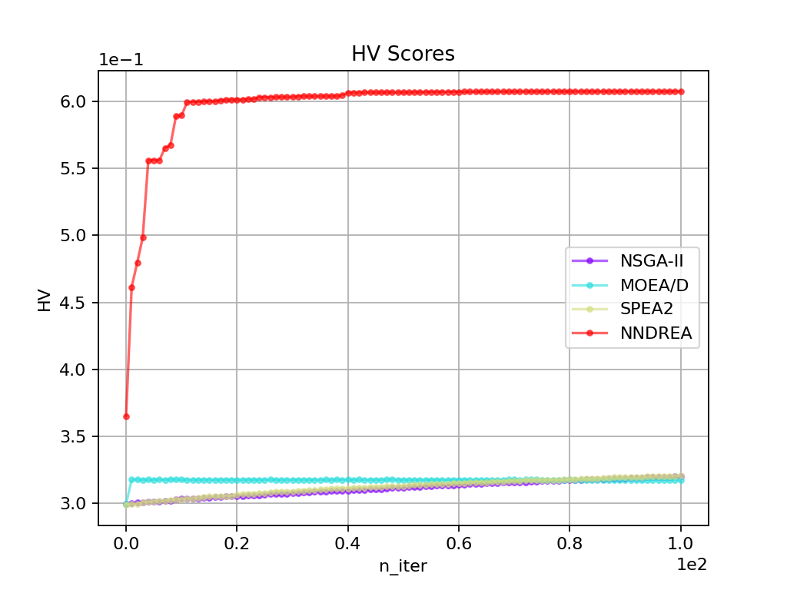

# CHOCCY

## 项目名称
基于NumPy构建的启发式优化器框架<br>
Chen's Heuristic Optimizer Constructed with Core numpY

## 项目简介
本项目是一个完全免费且开源的启发式优化器框架，致力于打造一个简单易用、绘图形式丰富且便于进行算法分析的启发式优化器框架。
本项目提供了大量启发式算法的实现细节，支持对`实数`、`整数`、`序列`、`(固定)标签`以及`混合`等类型问题的优化，
旨在为对优化领域感兴趣的伙伴们提供易于理解的算法学习资源和有力的研究支持。<br>
另外，本项目希望为学习、竞赛和科研等领域的伙伴提供高效易用的优化工具。
无论是初学者还是资深研究者，都能借助它快速设计和优化问题，并获得满意结果。
同时，不错的可视化功能可将结果转化为直观图表，方便用于论文撰写和报告制作，助力在学术与实践中取得优异成果。
<br><br>
**特别说明：`本代码仅供参考学习、竞赛和科学研究等非商业用途，在复制核心代码时请注明出处`**

## 安装教程
**1. 建议使用 `Anaconda` 创建 `Python` 环境**<br>
使用 Anaconda 创建环境可以方便地管理依赖包，避免版本冲突。建议从 [Anaconda 官网](https://www.anaconda.com/download/success) 下载并安装 Anaconda。如果需要特定版本，可以访问 [Anaconda所有版本下载地址](https://repo.anaconda.com/archive/)。<br>
安装完成后，运行以下命令创建 Python 环境：
```bash
conda create --name my_env python=3.9
conda activate my_env
```
**注意**：本项目支持 Python 3.7 及以上版本，建议使用 Python 3.9 以获得最佳兼容性。请确保已安装 Python 3.7 或更高版本。<br>
**2. 安装必要包**<br>
本项目依赖以下包: `numpy`、`scipy`、`matplotlib`、`tqdm`、`networkx`、`numba`。请确保已安装 Python 3.7 或更高版本，运行以下命令一键安装必要包：<br>
```bash
pip install numpy scipy matplotlib tqdm networkx numba
```

## 项目结构
```
CHOCCY/
├── Algorithms/                 # 算法集——优化器核心
│   ├── Multi/                  # 多目标优化算法
│   │   ├── MOEAD.py            # 基于分解的经典进化算法
│   │   ├── NNDREA.py           # 特殊二进制问题进化算法
│   │   └── NSGAII.py           # 经典多目标进化算法
│   ├── Single/                 # 单目标优化算法
│   │   ├── ACO.py              # 蚁群算法(TSP)
│   │   ├── DE.py               # 差分进化算法(实数)
│   │   ├── DP_KP.py            # 动态规划算法(KP)
│   │   ├── FI.py               # 最远插入算法(TSP)
│   │   ├── GA.py               # 遗传算法
│   │   ├── GFLS.py             # 引导快速局部搜索算法(TSP)
│   │   ├── Greedy_KP.py        # 贪婪算法(KP)
│   │   ├── HGA_TSP.py          # 混合启发式遗传算法(TSP)
│   │   ├── NNDREAS.py          # 特殊二进制问题算法(单目标)
│   │   ├── PSO.py              # 粒子群算法(实数)
│   │   └── SA.py               # 模拟退火算法
│   ├── Utility/                # 工具和功能函数
│   │   ├── Crossovers.py       # 交叉函数
│   │   ├── Educations.py       # 教育函数
│   │   ├── Mutations.py        # 变异函数
│   │   ├── Operators.py        # 算子函数(整合)
│   │   ├── Plots.py            # 绘图函数
│   │   ├── Selections.py       # 选择函数
│   │   └── Utils.py            # 各种工具函数
│   ├── ALGORITHM               # 算法函数父类
│   └── CONTRAST.py             # 算法对比封装函数
├── Datasets/                   # 数据集
│   ├── Multi/                  # 多目标问题数据集
│   └── Single/                 # 单目标问题数据集
├── Metrics/                    # 评价指标函数
│   └── Hypervolume.py          # 超体积指标
├── Problems/                   # 问题集
│   ├── Multi/                  # 多目标问题集
│   └── Single/                 # 单目标问题集
│   └── PROBLEM.py              # 问题父类
├── Run/                        # 算法优化问题实例
│   ├── Multi/                  # 多目标问题的优化实例
│   │   ├── Run_MOEAD.py        # 运行MOEA/D算法实例
│   │   ├── Run_NNDREA.py       # 运行NNDREA算法实例
│   │   ├── Run_NSGAII.py       # 运行NSGAII算法实例
│   │   ├── Solve_MOKP.py       # 多种算法求解MOKP问题对比实例
│   │   └── Solve_MoReal.py     # 多种算法求解多目标实数问题对比实例
│   └── Single/                 # 单目标问题的优化实例
│   │   ├── Run_GA.py           # 运行遗传算法实例
│   │   ├── Run_SA.py           # 运行模拟退火算法实例
│   │   ├── Solve_KP.py         # 多种算法求解KP问题对比实例
│   │   ├── Solve_Real.py       # 多种算法求解实数问题对比实例
│   │   └── Solve_TSP.py        # 多种算法求解TSP问题对比实例
└── README.md                   # 项目文档
```

**PS: 项目中包含本人研究工作**<br>
Neural Network-Based Dimensionality Reduction for Large-Scale Binary Optimization with Millions of Variables (NNDREA), IEEE Transactions on Evolutionary Computation <br>
原文下载地址：[IEEE xplore](https://ieeexplore.ieee.org/abstract/document/10530207) / [ResearchGate](https://www.researchgate.net/publication/380393707_Neural_Network-Based_Dimensionality_Reduction_for_Large-Scale_Binary_Optimization_with_Millions_of_Variables#:~:text=In%20this%20paper,%20we%20propose%20a%20dimensionality%20reduction%20method%20to) (免费下载)


## 快速开始

### 算法优化指定问题
假设已经定义了一个问题，以Ackley为例，问题如何定义的详细内容请参见[使用指南](./References/GUIDE.md)<br>
那么我们就可以直接实例化问题，并使用合适的算法进行优化：
```python
from Problems.Single.Ackley import Ackley  # 定义问题后导入问题
from Algorithms.Single.DE import DE  # 导入求解该问题的算法

problem = Ackley(num_dec=2)  # 实例化问题，并指定决策向量大小
# 实例化算法并设置种群大小为100，迭代次数为100，优化过程展示为目标值变化情况
alg = DE(problem, num_pop=100, num_iter=100, show_mode=DE.OBJ)
alg.run()  # 运行算法
# 获取最优解并打印
best, best_obj, best_con = alg.get_best()
print("最优解：", best)
print("最优解的目标值：", best_obj)
```
运行代码后可以看到优化过程动图，并给出最终结果。
```
最优解： [ 1.01622726e-15 -9.49773421e-16]
最优解的目标值： 3.9968028886505635e-15
```
下面给出不同参数下的效果动图：<br>
- 左图：`num_dec=2`, `show_mode=DE.OBJ`; 右图：`num_dec=1`, `show_mode=DE.OAD2`<br>


- 左图：`num_dec=2`, `show_mode=DE.OAD2`; 右图：`num_dec=2`, `show_mode=DE.OAD3`<br>


### 多种算法优化问题对比
仍然以Ackley为例，我们可以实例化该问题，并使用多种算法对比进行优化：
```python
from Problems.Single.Ackley import Ackley  # 导入问题
from Algorithms.Single.GA import GA  # 导入GA算法
from Algorithms.Single.DE import DE  # 导入DE算法
from Algorithms.CONTRAST import CONTRAST  # 导入对比类

problem = Ackley(num_dec=2)  # 实例化问题，并指定决策向量大小 
algorithms = dict()  # 将多个算法放入字典
num_pop, num_iter = 100, 100  # 定义所有算法的参数
# 实例化所有算法
algorithms['GA'] = GA(problem, num_pop, num_iter)
algorithms['DE/rand/1'] = DE(problem, num_pop, num_iter, operator_type=DE.RAND1)
algorithms['DE/best/1'] = DE(problem, num_pop, num_iter, operator_type=DE.BEST1)
# 定义算法对比类，并指定绘图模式为决策向量与目标向量绘制到同一个二维图像上
contrast = CONTRAST(problem, algorithms, show_mode=CONTRAST.OAD2, same_init=True)
contrast.run_contrast()  # 运行所有算法进行对比
# 绘制优化结果图，展示目标值变化情况
contrast.plot(show_mode=CONTRAST.OBJ)
```
运行代码后可以看到优化过程动图，并给出最终结果如下：<br>


```
Algorithm    GA              DE/rand/1       DE/best/1      
Ackley       5.228867e-03    1.713851e-06    2.176037e-14   
time(s)      3.272367e-02    2.751327e-02    2.319741e-02   
```


## 更新计划
- [x] 更新项目文档
- [ ] 更新使用指南
- [ ] 更新算法笔记
- [ ] 加入多问题多算法对比类
- [ ] 优化超体积的计算
- [ ] 加入其他评价指标
- [ ] 加入约束相关算法

## 效果展示
### 单目标问题优化
#### 算法优化不同类型问题
- 实数问题参考[快速开始](#快速开始)
- 运行`Run_GA`中的`Solve_TSP()`优化`TSP`问题; 运行`Solve_MixFixLabelCluster()`优化`混合`实数与标签问题<br>


#### 多种算法优化相同问题对比
- 运行`Solve_Real`对比`实数`问题优化; 运行`Solve_TSP`对比`TSP`问题优化<br>


```
Solve_Real.py
Algorithm    GA              SA              PSO             DE/rand/1       DE/rand/2       DE/best/1       DE/best/2      
Ackley       3.296624e-03    7.433576e-03    6.715419e-05    1.235109e-06    9.501386e-06    4.440892e-16    1.128765e-09   
time(s)      4.106760e-02    5.498104e-01    2.985716e-03    2.389169e-02    2.673411e-02    2.406955e-02    1.493549e-02   
```
```
Solve_TSP.py
Algorithm    GA              SA              ACO             HGA-TSP         FI              GFLS           
TSP          4.917393e+00    5.295691e+00    4.726050e+00    4.726050e+00    4.819092e+00    4.716354e+00   
time(s)      2.190208e-01    4.163930e-01    2.879641e+00    1.294901e+00    1.273990e-02    3.392506e-02  
```
### 多目标问题优化
#### 算法优化不同目标数问题
- 运行`Multi`下的`Run_NSGAII`对`ZDT3`问题优化; 运行`Run_MOEAD`对`DTLZ2`问题优化<br>

<br/>

#### 多种算法优化相同问题对比
- 运行`Solve_MoReal`对比`ZDT1`问题优化<br>

<br/>
```
Algorithm    NSGA-II         MOEA/D          SPEA2          
ZDT1         7.107659e-01    7.134855e-01    7.081822e-01   
time(s)      1.359894e+00    1.362040e+00    1.452784e+00   
```

- 运行`Solve_MOKP`对比`MOKP`问题(10000维)优化<br>

<br/>
```
Algorithm    NSGA-II         MOEA/D          SPEA2           NNDREA         
MOKP         3.695199e-01    3.957151e-01    3.682235e-01    6.028418e-01   
time(s)      5.158727e+00    8.979299e+00    4.523172e+00    8.853093e+00 
```
- 运行`Solve_MOKP`对比`MOKP`问题(100000维)优化<br>

<br/>
```
Algorithm    NSGA-II         MOEA/D          SPEA2           NNDREA         
MOKP         3.197438e-01    3.167430e-01    3.202157e-01    6.086408e-01   
time(s)      4.122707e+01    8.077614e+01    4.170565e+01    8.810133e+01  
```
(PS: 可以看到即使问题扩大十倍，NNDREA的效果几乎不变，仍然是收敛快且效果好)

## 参与贡献

**Luchen Wang**<br>
如在使用过程中遇到任何问题，可随时联系邮箱：wangluchen567@qq.com


