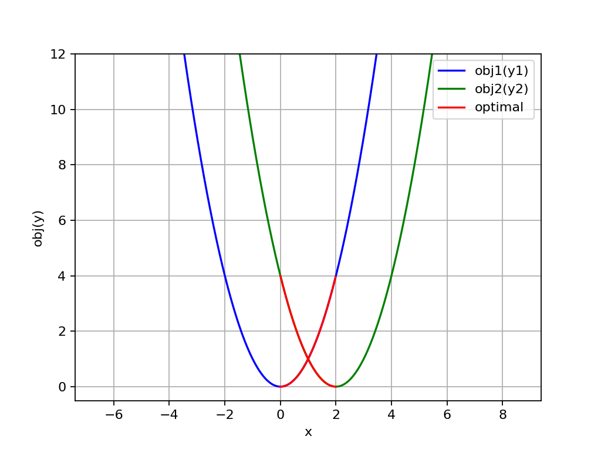
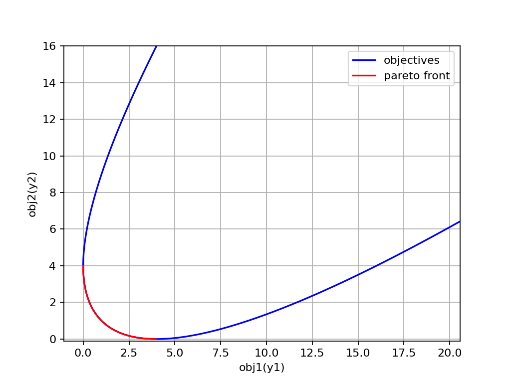

# CHOCCY优化器使用指南

## 目录
1. [简介](#简介)
2. [安装](#安装)
3. [背景知识](#背景知识)
4. [算法介绍](#算法介绍)
5. [快速开始](#快速开始)
6. [高级功能](#高级功能)
7. [常见问题](#常见问题)
8. [技术支持](#技术支持)

---

## 简介
CHOCCY是一个基于 NumPy 构建的启发式优化求解器，用于解决各种优化问题。<br>
它提供了多种优化算法与问题，支持自定义问题的求解，并支持自定义算法的扩展。<br>
本指南旨在帮助用户快速了解和使用优化器。无论您是初学者还是高级用户，都可以在这里找到所需的信息。

## 安装
### 环境要求
- Python 3.7 或更高版本
- numpy、scipy、matplotlib、seaborn、tqdm、networkx、numba 等依赖包

### 安装步骤
1. 使用 Anaconda 创建 Python 环境
   使用 Anaconda 创建环境可以方便地管理依赖包，避免版本冲突。建议从 [Anaconda 官网](https://www.anaconda.com/download/success) 下载并安装 Anaconda。如果需要特定版本，可以访问 [Anaconda所有版本下载地址](https://repo.anaconda.com/archive/)。安装完成 Anaconda 后，运行以下命令快速创建 Python 环境：
   
   ```bash
   conda create --name my_env python=3.9
   conda activate my_env

2. 下载 numpy、scipy、matplotlib、seaborn、tqdm、networkx、numba 等依赖包，运行以下命令一键安装必要包：

   ```bash
   pip install numpy scipy matplotlib seaborn tqdm networkx numba
   ```

## 背景知识
**在使用本项目求解问题之前，需要先熟悉一些背景知识**

### 决策向量/决策变量
决策向量可以理解为需要优化函数的自变量。假设要优化的函数为$y=f(x)$，那么其对应的决策向量为$x$。然而，实际情况下，决策向量通常是多个决策变量的组合。从数学角度来看，要优化的函数更准确的表达应为$y=f(\vec{x})$，其中$\vec{x}=(x_1, x_2, ..., x_n)$。也就是说，该决策向量是一个$n$维向量，换句话说，该决策向量包含$n$个决策变量。

### 目标函数
目标函数实际上就是需要优化的函数。为了统一优化方向，通常将其设定为最小化函数。例如，假设我们要优化（最小化）的函数是$y=f(x)=x^2$，我们都知道该函数在$x=0$时取得最小值$y=0$，这个过程可以通过计算导函数在$x=0$处取得的极小值，并与可能存在的多个极小值进行比较来得到（假如某函数还存在其他极小值的话），当然，其他求最小值的方法（比如梯度下降方法）也能得到这个结果。然而，对于一些复杂的函数，它们可能无法求导数/梯度，或者求导数/梯度的过程非常困难，那么就需要使用其他的方法（比如“启发式/元启发式”方法）来求最小值。另外，需要注意的是，由于决策向量，也就是输入的自变量，可能是多维的。以给出的例子为例，要最小化的函数就变为了$f(\vec{x})=\vec{x}^T\vec{x}$（即向量的平方和），该函数在$\vec{x}=(x_1, x_2, ..., x_n)=(0, 0, ..., 0)$时取得最小值。

### 多目标函数
在了解到目标函数的输入自变量，即决策向量可能是多维的之后，一个自然的延伸问题是：目标函数的输出变量，是否也可能是多维的向量呢？ 如果真是这样，那么目标函数就变为了多目标函数，换句话说，函数的输出可能是多个值，而我们需要同时对这几个值进行优化。

实际上，在大多数情况下，“多目标函数”是由多个目标函数组合而成的。举一个简单的例子：$y=f(x)=\{f_1(x), f_2(x)\} = \{x^2, x^2 + 1\}$，该函数是一个多目标函数，但它非常特殊。在这个例子中，当$x=0$时，两个函数都能同时取得最小值。换句话说，两个函数之间不存在任何“冲突”。这种情况下，同时优化两个函数似乎失去了意义，因为只要优化其中一个就能得到最小值。从狭义上严格来说，这种问题并不算是真正的多目标问题，因为它可以通过加权和的形式转换为单目标问题，优化得到的结果是一致的。

然而，严格来说，真正的多目标函数往往存在某种“冲突”，例如：$y=f(x)=\{f_1(x), f_2(x)\} = \{x^2, (x - 2)^2\}$。



在这个例子中，最优解是$x=[0, 2]$整个区间。因为在该区间中，随着一个目标的优化，另一个目标会变差。因此，无法找到一个最优的单个解，最终得到的解是一个区间。这个区间在目标空间中的状态被称为帕累托最优前沿(pareto front)。



其实，在生活中存在着许多典型的多目标问题。例如“投资回报问题”，该问题存在的冲突是“风险”与“收益”。一般来说，风险越高，收益越低，反之亦然。当然，多目标问题并不局限于双目标，还有三目标、甚至更多目标的情况。比如，在个人的人生规划中，通常会追求事业目标、家庭目标和个人兴趣目标。这三个目标相互交织，彼此影响，并存在潜在的冲突，例如，过度追求事业目标可能会牺牲与家人相处的时间，而过度投入个人兴趣则可能面临经济压力。因此，我们需要根据自己的价值观和优先级，找到一个相对平衡的解决方案。这种多目标决策过程在我们的生活中无处不在，无论是在个人生活、职业发展还是社会决策中，都需要我们不断地进行权衡和优化。

### 约束函数

除了目标函数以外，实际问题中往往还存在一定的约束条件。拿前面举的例子为例，假设我们要优化的函数是$f(x)=x^2$，约束函数是$g(x)=x-3\geq0$，那么该函数从原来的在$x=0$时取得最小值$y=0$，变为了在$x=3$时取得最小值$y=9$。然而，在实际问题中，约束函数可能会非常复杂，并且还可能存在“等式约束”的情况。

实际上，一般的元启发式算法并不擅长求解带有约束的优化问题，只有在求解较简单的约束时效果尚可。尤其是在存在强约束的情况下，即受到约束后搜索空间非常狭窄，问题会变得更加困难，尤其是当约束中包含“等式约束”时。狭窄的搜索空间会导致元启发式算法在初始化阶段随机生成的解很可能不满足约束条件，甚至全部都不满足约束。这可能会导致搜索过程中大量的计算资源被浪费在优化满足约束条件的解上，从而导致收敛缓慢。因此，通常需要设计专门用于处理约束的算法，例如通过每次修复解以满足约束条件等方法，从而使算法能够更好地向最优目标收敛。

## 算法介绍

### 多目标算法

多目标算法用于求解多目标问题，旨在同时优化多个目标函数。常见的效果较好且通用性强的多目标算法一般是元启发式方法，例如多目标进化算法(遗传算法)，本项目仅支持此类多目标算法，具体支持的算法清单可参见[实现清单](./IMPLES.md)


### 单目标算法
单目标算法用于求解单目标问题，只能优化单个目标函数，本项目仅支持启发式或元启发式的单目标算法，包括但不限于遗传算法、模拟退火算法、粒子群算法、蚁群算法、贪心算法、局部搜索算法等。具体支持的算法清单可参见[实现清单](./IMPLES.md)


## 快速开始

### 问题定义

在使用优化器求解问题之前，需要先明确问题的关键信息，以便正确实现问题。这些关键信息包括：

1. **问题的类型**：即属于`实数`、`整数`、`序列`、`(固定)标签`问题中的哪一种或哪几种
2. **决策变量的个数**：即决策向量的维度
3. **优化目标的个数**：即目标向量的维度
4. **决策变量下界**：即每个决策变量能取得的最小值
5. **决策变量上界**：即每个决策变量能取得的最大值

这些关键信息对应于问题实现中的重要参数：`problem_type`、`num_dec`、`num_obj`、`lower`、`upper`

以一个简单的问题为例，假设要求解的问题是$f(\vec{x})=\vec{x}^T\vec{x}$（即向量的平方和），我们可以确定该问题的关键信息如下：

1. **问题的类型**：该问题是单纯的`实数`问题
2. **决策变量的个数**：不确定，但可以指定，默认为 30
3. **优化目标的个数**：只有单个目标
4. **决策变量下界**：不确定，但为了缩小范围，均指定为 -100
5. **决策变量上界**：不确定，但为了缩小范围，均指定为 100

在确定问题信息时需要注意以下几点：
- 由于给出的例子是特殊的，最终结果是求和，因此决策变量的个数可以不确定。但通常情况下，具体问题的决策变量个数是确定的。
- 对于决策变量的上下界，建议在确定问题信息时大致估算一个数值范围，该范围应尽可能包含函数的最优解。

根据上述信息，可以得到实现该问题的关键参数：
- `problem_type=real`
- `num_dec=30`
- `num_obj=1`
- `lower=-10`
- `upper=10`

在确定好问题的关键信息之后，我们就可以根据这些信息初始化问题类了。所有的问题类都必须继承自 `Problems` 模块下的 `PROBLEM` 父类，这样可以方便后续的预处理和算法调用。

以下是示例代码：

```python
import numpy as np
from Problems import PROBLEM
class Sphere(PROBLEM):
    def __init__(self, num_dec=30, lower=-100, upper=100):
        super().__init__(problem_type=PROBLEM.REAL, num_dec=num_dec, num_obj=1, lower=lower, upper=upper)
```
在上述代码中，需要注意三个参数：
1. **`problem_type`参数**
    
    该参数可以直接调用父类 `PROBLEM` 下的静态变量作为输入，也可以直接输入对应的整数值。具体每种问题类型对应的变量值如下：
    ```python
    REAL = 0  # 实数
    INT = 1  # 整数
    BIN = 2  # 二进制
    PMU = 3  # 序列
    FIX = 4  # 固定标签
    ```
    此外，`problem_type` 参数还可以通过输入 `np.array` 数组来指定每一位决策变量的类型。例如，假设输入为：
    ```python
    problem_type=np.array([0, 0, 1, 2])
    ```
    或者：
    ```python
    problem_type=np.array([PROBLEM.REAL, PROBLEM.REAL, PROBLEM.INT, PROBLEM.BIN])
    ```
    那么，输入的决策变量的每一位对应的类型分别为：【`实数`、`实数`、`整数`、`二进制`】。需要注意的是，当输入是 `np.array` 数组时，数组的大小必须与决策变量的个数 `num_dec` 相匹配。
     
2. **`lower`和`upper`参数**

   这两个参数与 `problem_type` 参数类似。当输入单独的值时，指定的是所有决策变量的统一下界和上界。也可以通过输入 `np.array` 来指定每一位决策变量的下界和上界，但数组的大小必须与决策变量的个数 `num_dec` 相匹配。

在初始化问题之后，必须实现问题的目标函数。为此，可以覆写 `_cal_obj` 或 `_cal_objs` 中的任意一个方法来实现目标函数。两者的区别在于 `_cal_obj` 是针对单个解计算目标值，而 `_cal_objs` 是针对多个解批量计算目标值。

如果仅覆写了 `_cal_obj` 方法，`PROBLEM` 父类会自动使用 `for` 循环逐次调用 `_cal_obj` 以逐个计算多个解的目标值（具体可参见源码）。然而，为了打破 Python 中 for 循环的效率瓶颈，建议覆写 `_cal_objs` 方法，并利用 `Numpy` 的矩阵操作来计算目标值，这样效率会更高。以下是直接使用矩阵操作实现目标值计算的示例代码：

```python
    def _cal_objs(self, X):
        objs = np.sum(X**2, axis=-1)
        return objs
```

此外，需要注意的是，输入的 `X` 变量一定是一个二维矩阵。即使决策变量的个数为 `1`，输入的形状也应为 `(n, 1)`，其中 `n` 表示解的个数。

### 多目标问题定义

待更新


### 算法选择
定义好问题之后，需要选择一个或多个合适的算法进行求解，具体算法适用求解问题类型可见[算法介绍](#算法介绍)。

对于前面定义的`Sphere`问题，我们可以直接调用合适的单目标算法来求解，以差分进化算法为例：

```python
import numpy as np
from Problems import PROBLEM
from Algorithms.Single import DE

class Sphere(PROBLEM):
    """定义问题"""
    def __init__(self, num_dec=30, lower=-100, upper=100):
        num_obj = 1
        super().__init__(PROBLEM.REAL, num_dec, num_obj, lower, upper)
        
    def _cal_objs(self, X):
        objs = np.sum(X**2, axis=-1)
        return objs
    
if __name__ == '__main__':
    problem = Sphere(num_dec=10)  # 实例化问题，并指定决策向量大小
    # 实例化算法并设置种群大小为100，迭代次数为100，优化过程展示为目标值变化情况
    algorithm = DE(pop_size=100, max_iter=100, show_mode=DE.OBJ)
    algorithm.solve(problem)  # 使用该算法求解问题
    # 获取最优解并打印
    best, best_obj, best_con = algorithm.get_best()
    print("最优解：", best)
    print("最优解的目标值：", best_obj)
    print("算法运行时间(秒)：", algorithm.run_time)
```

运行代码后可以看到优化过程动图，并给出最终结果


### 比较器的使用

待更新

### 评估器的使用

待更新

## 高级功能

### 混合类型问题

待更新

### 算法自定义

待更新

## 常见问题
- **问题 1**：为什么遗传算法等元启发式算法对简单函数得到的结果不精确，也就是存在精度？
  - **问题原因**：这是遗传算法等元启发式算法本身的特性，即使是最简单的函数，也存在一些精度上的不准确
  - **解决方案**：对与简单问题，若想让精度准确，请使用其他的算法（比如梯度算法）提高精度。
- **问题 2**：为什么大部分算法对问题优化和求解得到的结果非常不稳定？
  - **问题原因**：由于大部分算法是启发式或元启发式算法，本身具有一定的随机性，所以求解不稳定，
  - **解决方案**：若想让求解稳定，可以使用`np.random.seed`函数指定随机种子以使得求解稳定。
- **问题 3**：在使用Evaluator对算法进行评估时，绘制的小提琴图上下界为什么会不准确？
  - **问题原因**：小提琴图是基于核密度估计绘制的，由于核密度估计的特性，小提琴图的范围可能会超出实际数据的范围。
  - **解决方案**：若想让小提琴图绘制准确，在函数`plot_violin()`中加入参数`cut=0`即可

## 技术支持
如果您在使用过程中遇到任何问题，可随时联系
- 邮箱：wangluchen567@qq.com


