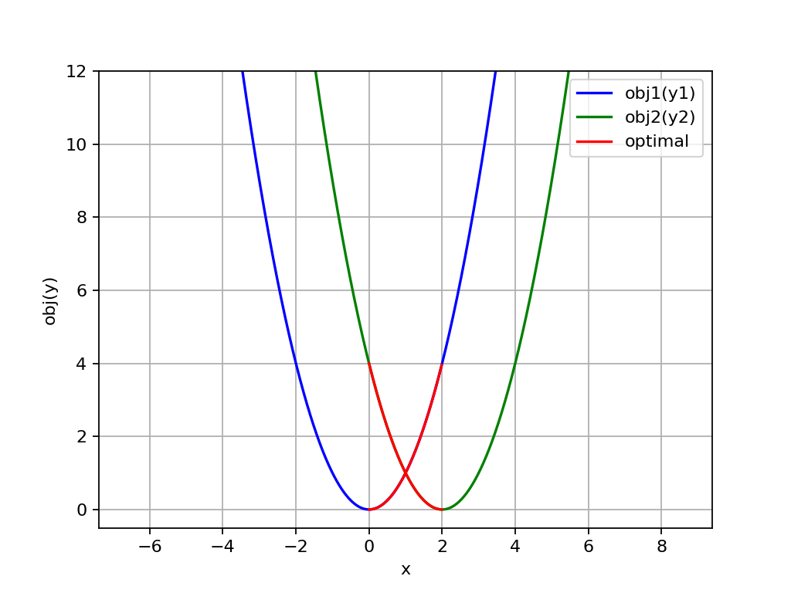
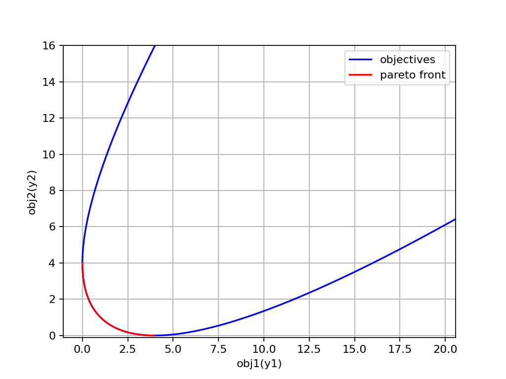
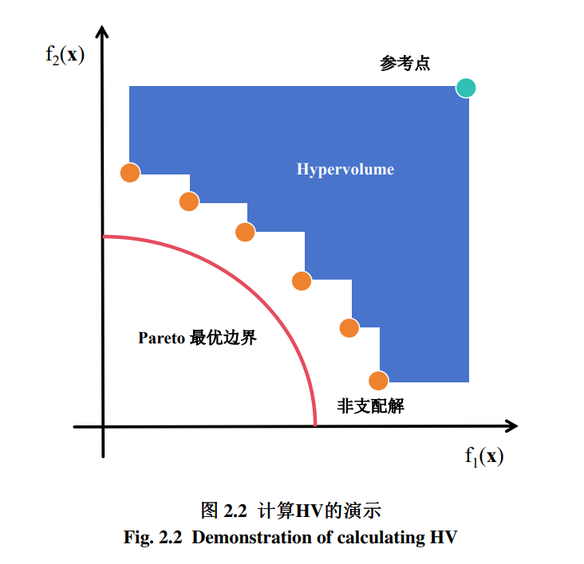

# CHOCCY优化求解器使用指南

## 目录
- [简介](#简介)
- [安装教程](#安装教程)
- [背景知识](#背景知识)
  - [决策向量与决策变量](#决策向量与决策变量)
  - [多目标函数](#多目标函数)
  - [约束函数](#约束函数)
  - [评价指标](#评价指标)
- [算法介绍](#算法介绍)
  - [多目标优化算法](#多目标优化算法)
  - [单目标优化算法](#单目标优化算法)
- [基础功能](#基础功能)
  - [问题定义与实现](#问题定义与实现)
  - [算法选择与调用](#算法选择与调用)
  - [算法绘图与可视化](#算法绘图与可视化)
  - [结果的保存与读取](#结果的保存与读取)
- [进阶功能](#进阶功能)
  - [多目标问题的定义与实现](#多目标问题的定义与实现)
  - [带约束问题的定义与实现](#带约束问题的定义与实现)
  - [算法比较器的使用](#算法比较器的使用)
  - [算法评估器的使用](#算法评估器的使用)
- [高级功能](#高级功能)
  - [混合类型问题的定义与实现](#混合类型问题的定义与实现)
  - [算法的自定义与实现](#算法的自定义与实现)
- [常见问题](#常见问题)
- [技术支持](#技术支持)

---

## 简介
CHOCCY 是一个基于 NumPy 构建的启发式优化求解器，支持对`实数`、`整数`、`序列`、`(固定)标签`以及`混合`类型问题的优化求解。<br>
它内置了多种优化算法和问题模板，同时支持用户自定义问题的优化求解。此外，CHOCCY 提供了丰富的可视化功能，以及一系列性能评估指标、优化算子和函数，为扩展自定义算法提供了支持。<br>
本指南旨在帮助用户快速了解和使用优化求解器。无论您是初学者还是高级用户，都可以在这里找到所需的信息。

## 安装教程
### 1. 使用 pip 安装（推荐）

直接安装完整版本（包含 numba 加速）：

```bash
pip install choccy
```

如果遇到 numba 相关的报错，或希望安装无 numba 加速的版本：

```bash
pip install choccy[no-numba]
```

如果 tbb 加速不适配当前系统：

```bash
pip install choccy[no-tbb]
```

> 💡 **提示**：以上三种安装方式可根据实际情况选择其一。

### 2. 从 whl 文件安装

从 [Releases 页面](https://github.com/yourname/choccy/releases) 下载对应版本的 `.whl` 文件，切换到文件所在目录后执行（以 0.1.0 版本为例）：

```bash
pip install choccy-0.1.0-py3-none-any.whl
```

### 3. 本地源码运行（适用于开发或调试）

如果不希望安装，可以直接下载项目源码进行本地运行和测试。

#### 3.1 使用 Conda 创建虚拟环境（推荐）

建议使用 Anaconda 创建独立的 Python 环境，便于管理依赖包、避免版本冲突。

- 从 [Anaconda 官网](https://www.anaconda.com/download/success) 下载并安装
- 如需特定版本，可访问 [历史版本下载地址](https://repo.anaconda.com/archive/)

创建并激活环境：

```bash
conda create --name choccy_env python=3.9
conda activate choccy_env
```

> 📌 **注意**：本项目支持 Python 3.7 及以上版本，推荐使用 Python 3.9 以获得最佳兼容性。

#### 3.2 安装必需依赖

```bash
pip install numpy scipy matplotlib seaborn tqdm networkx
```

#### 3.3 安装可选加速依赖（建议）

为了获得更快的优化速度，建议安装 numba 和 tbb：

```bash
pip install numba tbb
```

#### 3.4 使用国内镜像源加速下载（可选）

如果下载速度较慢，可尝试使用清华大学镜像源：

```bash
pip install numpy scipy matplotlib seaborn tqdm networkx numba tbb -i https://pypi.tuna.tsinghua.edu.cn/simple
```

也可选择其他镜像源，例如：中国科技大学（https://pypi.mirrors.ustc.edu.cn/simple/）、阿里云（https://mirrors.aliyun.com/pypi/simple/）。

## 背景知识
**在使用本项目求解问题之前，需要先熟悉一些背景知识**

### 决策向量与决策变量
决策向量可以理解为需要优化函数的自变量。假设要优化的函数为$y=f(x)$，那么其对应的决策向量为$x$。然而，实际情况下，决策向量通常是多个决策变量的组合。从数学角度来看，要优化的函数更准确的表达应为$y=f(\vec{x})$，其中$\vec{x}=(x_1, x_2, ..., x_n)$。也就是说，该决策向量是一个$n$维向量，换句话说，该决策向量包含$n$个决策变量。

### 目标函数
目标函数实际上就是需要优化的函数。为了统一优化方向，通常将其设定为最小化函数。例如，假设我们要优化（最小化）的函数是$y=f(x)=x^2$，我们都知道该函数在$x=0$时取得最小值$y=0$，这个过程可以通过计算导函数在$x=0$处取得的极小值，并与可能存在的多个极小值进行比较来得到（假如某函数还存在其他极小值的话），当然，其他求最小值的方法（比如梯度下降方法）也能得到这个结果。然而，对于一些复杂的函数，它们可能无法求导数/梯度，或者求导数/梯度的过程非常困难，那么就需要使用其他的方法（比如“启发式/元启发式”方法）来求最小值。另外，需要注意的是，由于决策向量，也就是输入的自变量，可能是多维的。以给出的例子为例，要最小化的函数就变为了$f(\vec{x})=\vec{x}^T\vec{x}$（即向量的平方和），该函数在$\vec{x}=(x_1, x_2, ..., x_n)=(0, 0, ..., 0)$时取得最小值。

### 多目标函数
在了解到目标函数的输入自变量，即决策向量可能是多维的之后，一个自然的延伸问题是：目标函数的输出变量，是否也可能是多维的向量呢？ 如果真是这样，那么目标函数就变为了多目标函数，换句话说，函数的输出可能是多个值，而我们需要同时对这几个值进行优化。

实际上，在大多数情况下，“多目标函数”是由多个目标函数组合而成的。举一个简单的例子：$y=f(x)=\{f_1(x), f_2(x)\} = \{x^2, x^2 + 1\}$，该函数是一个多目标函数，但它非常特殊。在这个例子中，当$x=0$时，两个函数都能同时取得最小值。换句话说，两个函数之间不存在任何“冲突”。这种情况下，同时优化两个函数似乎失去了意义，因为只要优化其中一个就能得到最小值。从狭义上严格来说，这种问题并不算是真正的多目标问题，因为它可以通过加权和的形式转换为单目标问题，优化得到的结果是一致的。

然而，严格来说，真正的多目标函数往往存在某种“冲突”，例如：$y=f(x)=\{f_1(x), f_2(x)\} = \{x^2, (x - 2)^2\}$。



在这个例子中，最优解是$x=[0, 2]$整个区间。因为在该区间中，随着一个目标的优化，另一个目标会变差。因此，无法找到一个最优的单个解，最终得到的解是一个区间。这个区间在目标空间中的状态被称为帕累托最优前沿(pareto front)。



其实，在生活中存在着许多典型的多目标问题。例如“投资回报问题”，该问题存在的冲突是“风险”与“收益”。一般来说，风险越高，收益越低，反之亦然。当然，多目标问题并不局限于双目标，还有三目标、甚至更多目标的情况。比如，在个人的人生规划中，通常会追求事业目标、家庭目标和个人兴趣目标。这三个目标相互交织，彼此影响，并存在潜在的冲突，例如，过度追求事业目标可能会牺牲与家人相处的时间，而过度投入个人兴趣则可能面临经济压力。因此，我们需要根据自己的价值观和优先级，找到一个相对平衡的解决方案。这种多目标决策过程在我们的生活中无处不在，无论是在个人生活、职业发展还是社会决策中，都需要我们不断地进行权衡和优化。

### 约束函数

除了目标函数以外，实际问题中往往还存在一定的约束条件。拿前面举的例子为例，假设我们要优化的函数是$f(x)=x^2$，约束函数是$g(x)=x-3\geq0$，那么该函数从原来的在$x=0$时取得最小值$y=0$，变为了在$x=3$时取得最小值$y=9$。然而，在实际问题中，约束函数可能会非常复杂，并且还可能存在“等式约束”的情况。

实际上，一般的元启发式算法并不擅长求解带有约束的优化问题，只有在求解较简单的约束时效果尚可。尤其是在存在强约束的情况下，即受到约束后搜索空间非常狭窄，问题会变得更加困难，尤其是当约束中包含“等式约束”时。狭窄的搜索空间会导致元启发式算法在初始化阶段随机生成的解很可能不满足约束条件，甚至全部都不满足约束。这可能会导致搜索过程中大量的计算资源被浪费在优化满足约束条件的解上，从而导致收敛缓慢。因此，通常需要设计专门用于处理约束的算法，例如通过每次修复解以满足约束条件等方法，从而使算法能够更好地向最优目标收敛。

### 评价指标

评价指标是衡量算法对某个问题优化效果的关键工具，尤其是在多目标问题中，其重要性不言而喻。对于多目标问题，常见的评价指标包括：

1. 超体积指标 (HV)
2. 代际距离指标 (GD)
3. 逆代际距离指标 (IGD)
4. 代际距离+指标 (GD+)
5. 逆代际距离+指标 (IGD+) 等

值得注意的是，在真实世界的多目标问题中，Pareto最优前沿通常是未知的。因此，我们通常通过给定参考点，使用超体积指标来进行评价。以下是超体积指标的定义：

**超体积指标 (HV)** 是一种衡量多目标优化算法性能的重要指标，它表示由非支配解集和参考点围成的超体积大小。具体来说，超体积指标反映了优化解集在目标空间中所覆盖的区域大小。超体积越大，说明解集的多样性和接近性越好，优化效果也更佳。其计算公式为：
$$
HV = \text{Volume}(\{y \in \mathbb{R}^m \mid y \succ \text{参考点}, y \prec \text{非支配解集}\})
$$
其中，$\succ$ 表示优于，$\prec$ 表示劣于。超体积指标不仅考虑了解集的分布，还反映了其与参考点的相对位置，是评估多目标优化算法性能的有力工具。



## 算法介绍

### 多目标优化算法

多目标优化算法用于求解多目标问题，旨在同时优化多个目标函数。常见的效果较好且通用性强的多目标算法一般是元启发式方法，例如多目标进化算法(遗传算法)，本项目仅支持此类多目标算法，具体支持的算法清单可参见[实现清单](./IMPLES.md)


### 单目标优化算法
单目标优化算法用于求解单目标问题，只能优化单个目标函数，本项目仅支持启发式或元启发式的单目标算法，包括但不限于遗传算法、模拟退火算法、粒子群算法、蚁群算法、贪心算法、局部搜索算法等。具体支持的算法清单可参见[实现清单](./IMPLES.md)


## 基础功能

### 前置知识

在正式开始之前，建议先熟悉以下面向对象编程的基本概念：

- 类与对象
- 父类与子类
- 继承与覆写

掌握这些基础知识将帮助你更轻松地扩展和定制项目中的问题与算法。

### 问题定义与实现

在使用优化器求解问题之前，需要先明确问题的关键信息。这些信息包括：

| 序号 | 关键信息    | 对应参数        | 说明                       |
|:--:|:--------|:------------|:-------------------------|
| 1  | 问题的类型   | `var_types` | 属于实数、整数、序列、固定标签中的哪一种或哪几种 |
| 2  | 决策变量的个数 | `n_vars`    | 决策向量的维度                  |
| 3  | 优化目标的个数 | `n_objs`    | 目标向量的维度（需最小化的目标数量）       |
| 4  | 约束条件的个数 | `n_cons`    | 约束向量的维度（需满足的不等式或等式约束数量）  |
| 5  | 决策变量下界  | `l_bounds`  | 每个决策变量能取得的最小值            |
| 6  | 决策变量上界  | `u_bounds`  | 每个决策变量能取得的最大值            |

**示例：平方和问题**

假设要求解的问题是：

$f(\vec{x})=\vec{x}^T\vec{x}$

即向量的平方和。该问题的关键信息确定如下：

| 关键信息   | 取值   | 说明        |
|:-------|:-----|:----------|
| 问题类型   | 实数问题 | 单纯实数优化    |
| 决策变量个数 | 2    | 可指定，默认为 2 |
| 优化目标个数 | 1    | 单目标优化     |
| 约束条件个数 | 0    | 无约束       |
| 决策变量下界 | -100 | 缩小搜索范围    |
| 决策变量上界 | 100  | 缩小搜索范围    |

在确定问题信息时，需要注意以下几点：
- 决策变量的个数：在示例问题中，由于最终结果为求和形式，决策变量的个数可以不固定。但在一般问题中，决策变量的个数通常是确定的。
- 决策变量的上下界：建议在问题定义阶段，先对每个决策变量的取值范围进行大致估算。该范围应尽可能覆盖目标函数的最优解区域。
- 约束条件的处理：对于一般的无约束问题，可以不指定约束条件的个数，默认会采用无约束求解方式。需要注意的是，给定的约束条件越多，问题求解的难度通常越大。 因此，建议尽量将多个约束合并为一个，甚至进一步将问题转化为无约束形式进行求解。

根据上述信息，得到实现该问题的关键参数：

```python
var_types = Problem.REAL
n_vars = 2
n_objs = 1
n_cons = 0      # 可省略，默认为 0
l_bounds = -100
u_bounds = 100
```

> 📌 **注意**：对于无约束问题（`n_cons = 0`），该参数可以省略，默认值为 0。

### 创建问题实例

在确定问题的关键信息之后，就可以根据这些信息创建问题了。本项目提供了两种创建问题的方式。

#### 方式一：使用函数创建（推荐）

适用于快速原型验证和简单问题。

**逐点计算（适合小规模问题）**

对于简单的小规模问题，可以直接定义单个计算的目标函数：

```python
import numpy as np
from choccy.problems import Problem, create_problem

# 定义目标函数（接收单个解，返回目标值）
def calc_sphere_obj(x):
    return np.sum(x ** 2)

# 创建问题实例
problem = create_problem(
    calc_obj=calc_sphere_obj,     # 目标函数（单个计算）
    var_types=Problem.REAL,       # 决策变量类型：实数
    n_vars=2,                     # 决策变量个数
    n_objs=1,                     # 目标个数
    l_bounds=-100,                # 变量下界
    u_bounds=100                  # 变量上界
)
```

**向量化计算（推荐用于大规模/高维问题）**

对于大规模或高维问题，建议使用向量化方式批量计算，可显著提升优化效率：

```python
import numpy as np
from choccy.problems import Problem, create_problem

# 定义目标函数（接收解矩阵，批量返回目标值向量）
def calc_sphere_objs_mat(xs):
    # xs 形状为 (n_solutions, n_vars)
    # 返回形状为 (n_solutions,) 或 (n_solutions, 1)
    return np.sum(xs ** 2, axis=1)

# 创建问题实例
problem = create_problem(
    calc_objs_mat=calc_sphere_objs_mat,  # 向量化目标函数（批量计算）
    var_types=Problem.REAL,              # 决策变量类型：实数
    n_vars=2,                            # 决策变量个数
    n_objs=1,                            # 目标个数
    l_bounds=-10,                        # 变量下界
    u_bounds=10                          # 变量上界
)
```

#### 方式二：继承 Problem 类（适合复用与扩展）

如果需要多次使用同一问题，或在多个算法中进行对比测试，建议通过继承 `Problem` 父类的方式来定义问题。所有自定义问题类都必须继承自 `Problem` 类。

**示例：定义 Rastrigin 问题**

```python
import numpy as np
from choccy.problems import Problem

class Rastrigin(Problem):
    def __init__(self, n_vars=30, l_bounds=-5.12, u_bounds=5.12):
        # 调用父类 Problem 的构造方法，初始化父类属性
        super().__init__(
            var_types=self.REAL,
            n_vars=n_vars,
            n_objs=1,
            l_bounds=l_bounds,
            u_bounds=u_bounds
        )
        # 子类 Rastrigin 会继承父类 Problem 的所有属性和方法
        # 通过 super().__init__() 确保父类逻辑正确执行，避免重复代码

    def calc_objs_mat(self, xs):
        # 向量化计算 Rastrigin 函数值
        objs = np.sum(xs ** 2 - 10 * np.cos(2 * np.pi * xs) + 10, axis=1)
        return objs
```

#### 参数详细说明

**1. `var_types`（决策变量类型）**

该参数用于指定决策变量的类型。可以直接使用 `Problem` 父类中定义的静态变量，也可以直接输入对应的整数值。

**支持的类型对照表：**

| 类型 | 静态变量 | 整数值 | 说明 |
|:-----|:---------|:------:|:-----|
| 实数 | `Problem.REAL` | 1 | 连续实数变量 |
| 整数 | `Problem.INT` | 2 | 整数变量 |
| 二进制 | `Problem.BIN` | 3 | 0/1 二进制变量 |
| 序列 | `Problem.PMU` | 4 | 排列序列变量（如 TSP） |
| 固定标签 | `Problem.FIX` | 5 | 固定类别标签变量 |

**使用示例：**

```python
# 所有变量类型相同
var_types = Problem.REAL

# 为每个变量单独指定类型（需与 n_vars 长度一致）
var_types = np.array([Problem.REAL, Problem.REAL, Problem.INT, Problem.BIN])

# 继承父类后可使用 self 调用
var_types = np.array([self.REAL, self.REAL, self.INT, self.BIN])
```

> 📌 **注意**：当 `var_types` 为数组时，数组长度必须与决策变量个数 `n_vars` 保持一致。

**2. `l_bounds` 和 `u_bounds`（决策变量边界）**

这两个参数用于指定决策变量的下界和上界，用法与 `var_types` 类似：

| 输入形式 | 行为 |
|:---------|:-----|
| 单个数值 | 所有变量共享相同的边界 |
| 数组（长度 = `n_vars`） | 为每个变量单独指定边界 |

**使用示例：**

```python
# 所有变量边界相同
l_bounds = -100
u_bounds = 100

# 为每个变量单独指定边界
l_bounds = np.array([-100, -50, -10, 0])
u_bounds = np.array([100, 50, 10, 20])
```

> 📌 **注意**：当使用数组形式时，数组长度必须与决策变量个数 `n_vars` 保持一致。

#### 实现目标函数

在初始化问题之后，必须实现问题的目标函数。可以通过覆写 `calc_obj` 或 `calc_objs_mat` 中的任意一个方法来完成。

**两种方法的区别**

| 方法 | 输入 | 输出 | 适用场景 |
|:-----|:-----|:-----|:---------|
| `calc_obj` | 单个解 `x`（形状为 `(n_vars,)`） | 单个目标值（标量） | 简单问题、快速验证 |
| `calc_objs_mat` | 解矩阵 `xs`（形状为 `(n_solutions, n_vars)`） | 目标值向量（形状为 `(n_solutions,)` 或 `(n_solutions, n_objs)`） | 大规模问题、追求效率 |

**方法一：覆写 `calc_obj`（逐个计算）**

```python
def calc_obj(self, x):
    return np.sum(x ** 2 - 10 * np.cos(2 * np.pi * x) + 10)
```

如果仅覆写 `calc_obj` 方法，`Problem` 父类会自动通过 `for` 循环逐次调用 `calc_obj` 来计算多个解的目标值。这种方式实现简单，但运行效率较低。

**方法二：覆写 `calc_objs_mat`（向量化计算，推荐）**

为了突破 Python `for` 循环的效率瓶颈，推荐覆写 `calc_objs_mat` 方法，利用 NumPy 的矩阵操作批量计算目标值：

```python
def calc_objs_mat(self, xs):
    # xs 形状: (n_solutions, n_vars)
    objs = np.sum(xs ** 2 - 10 * np.cos(2 * np.pi * xs) + 10, axis=1)
    return objs  # 形状: (n_solutions,)
```

#### 实现多目标函数

对于多目标优化问题，目标函数返回值的形状应为 `(n_solutions, n_objs)`。

**基础示例：MOP1**

以下是一个简单的双目标优化问题示例：

```python
import numpy as np
from choccy.problems import Problem

class MOP1(Problem):
    def __init__(self, l_bounds=-1000.0, u_bounds=1000.0):
        """
        MOP1 双目标优化问题

        min   f1(x) = x^2
        min   f2(x) = (x - 2)^2
        """
        super().__init__(
            var_types=self.REAL,
            n_vars=1,
            n_objs=2,
            l_bounds=l_bounds,
            u_bounds=u_bounds
        )

    def calc_objs_mat(self, xs: np.ndarray):
        """计算目标函数值"""
        f1 = xs ** 2
        f2 = (xs - 2) ** 2
        objs = np.column_stack((f1, f2))  # 形状: (n_solutions, 2)
        return objs
```

**指定帕累托最优前沿（已知前沿的问题）**

对于已知帕累托最优前沿的多目标问题，建议覆写 `get_optimums` 方法来指定最优前沿信息。该方法返回的即为问题的理论帕累托最优解集。

```python
def get_optimums(self):
    """获取理论最优目标值（帕累托前沿）"""
    optimums = np.zeros((self.n_optimums, 2))
    optimums[:, 0] = np.linspace(0, 4, self.n_optimums)
    optimums[:, 1] = (np.sqrt(optimums[:, 0]) - 2) ** 2
    return optimums
```

如果需要直接绘制最优前沿图像，可以覆写 `get_pareto_front` 方法：

```python
def get_pareto_front(self):
    """获取用于绘图的帕累托最优前沿"""
    return self.get_optimums()
```

> 📌 **注意**：当绘制三维空间中的帕累托前沿图像时，若前沿表现为空间中的曲线，则可能需要添加微小扰动才能正确显示。具体实现可参考 `DTLZ5` 问题的源码。

**指定参考点信息（未知前沿的问题）**

对于帕累托最优前沿未知的多目标问题，建议指定参考点信息，以便算法计算超体积指标（Hypervolume）。超体积指标的定义参见 [评价指标](#评价指标)。

为了简化接口，`get_optimums` 方法承担了双重职责：

| 场景   | `get_optimums` 返回内容  | 用途             |
|:-----|:---------------------|:---------------|
| 前沿已知 | 帕累托最优前沿              | 理论最优解集，用于可视化对比 |
| 前沿未知 | 参考点（Reference Point） | 超体积指标计算        |

```python
def get_optimums(self):
    """
    返回参考点信息（当前沿未知时）

    参考点通常设置为各目标的上界估计值，
    用于计算超体积指标。
    """
    # 返回形状为 (1, n_objs) 或 (n_objs,)
    return np.array([100.0, 100.0])
```

#### 实现约束函数（可选）

如果问题存在约束条件，可以通过覆写 `calc_cons` 或 `calc_cons_mat` 方法来实现。

**约束函数的规范**

在实现约束函数时，需要遵循一个重要规范：**所有约束必须转换为单侧小于等于 0 的不等式形式**。

即，对于任意约束条件，应将其改写为：

$g(\vec{x}) \leq 0$

其中，满足约束的条件是 $g(\vec{x}) \leq 0$，不满足时 $g(\vec{x}) > 0$，且数值越大表示违反约束的程度越严重。算法会尽量减小约束值，以引导解向可行域靠近。

**约束转换示例**

| 原始约束               | 转换后（$g(\vec{x}) \leq 0$）           |
|:-------------------|:-----------------------------------|
| $x_1 + x_2 \geq 1$ | $1 - (x_1 + x_2) \leq 0$           |
| $x_1 + x_2 \leq 5$ | $x_1 + x_2 - 5 \leq 0$             |
| $x_1 = x_2$        | $\|x_1 - x_2\| \leq 0$（或拆分为两个不等式）  |
| $x_i > 0$（隐式约束）    | $-x_i \leq 0$（或通过边界 `l_bounds` 处理） |

**示例：带约束的 Sphere 问题**

假设要求解的问题是：

$$
\min \quad f(\vec{x}) = \vec{x}^T \vec{x} = \sum_{i=1}^{n} x_i^2
$$
约束条件为：

$$
\sum_{i=1}^{n} x_i \geq 1 \quad \text{（所有元素之和大于等于 1）}
$$
$$
x_i > 0 \quad \text{（每个元素均大于 0）}
$$

其中，$x_i > 0$ 为隐式约束，可通过设置决策变量下界 `l_bounds = 0` 来处理，无需在约束函数中显式实现。

**完整实现代码**

```python
import numpy as np
from choccy.problems import Problem

class SphereConstrained(Problem):
    def __init__(self, n_vars=10, l_bounds=0, u_bounds=10):
        """
        带不等式约束的 Sphere 问题

        min   sum(x_i^2)
        s.t.  sum(x_i) >= 1
              x_i >= 0
        """
        super().__init__(
            var_types=self.REAL,
            n_vars=n_vars,
            n_objs=1,
            l_bounds=l_bounds,
            u_bounds=u_bounds
        )

    def calc_objs_mat(self, xs: np.ndarray):
        """计算目标函数值"""
        return np.sum(xs ** 2, axis=1)

    def calc_cons_mat(self, xs: np.ndarray):
        """
        计算约束函数值

        约束：sum(x_i) >= 1
        转换为 g(x) = 1 - sum(x_i) <= 0
        """
        return 1 - np.sum(xs, axis=1)

    def get_optimums(self):
        """返回理论最优解的目标值（可选）"""
        return 1.0 / self.n_vars
```

> 📌 **注意事项**：
> - 对于无约束问题，可以省略 `calc_cons_mat` 的实现，`n_cons` 默认为 0
> - 变量边界约束（如 $x_i > 0$）建议通过 `l_bounds` 和 `u_bounds` 参数设置，无需在约束函数中重复实现
> - 约束函数应尽可能使用向量化计算（NumPy 矩阵操作）以保证效率

### 算法选择与调用

定义好问题之后，需要选择一个或多个合适的算法进行求解。具体算法适用的求解问题类型，请参见 [算法介绍](#算法介绍) 与 [实现清单](./IMPLES.md)。

#### 单目标优化示例

以之前定义的 `Rastrigin` 问题为例，调用差分进化算法（DE）进行求解：

```python
import numpy as np
from choccy.algorithms.single import DE
from choccy.problems import Problem, create_problem

# 定义目标函数（接收解矩阵，批量返回目标值向量）
def calc_rastrigin_objs(xs):
    # xs 形状为 (n_solutions, n_vars)
    # 返回形状为 (n_solutions,) 或 (n_solutions, 1)
    return np.sum(xs ** 2 - 10 * np.cos(2 * np.pi * xs) + 10, axis=1)

# 创建问题实例
problem = create_problem(
    calc_objs_mat=calc_rastrigin_objs,   # 向量化目标函数（批量计算）
    var_types=Problem.REAL,              # 决策变量类型：实数
    n_vars=2,                            # 决策变量个数
    n_objs=1,                            # 目标个数
    l_bounds=-10,                        # 变量下界
    u_bounds=10                          # 变量上界
)
# 定义并初始化算法
algorithm = DE(n_sols=50, max_iter=100, visual_mode='log')
# 使用算法优化问题
algorithm.optimize(problem)
# 报告优化结果信息
algorithm.report_result()
```
输出结果（日志部分已省略）：
```
[DE] Iter: 000/100 | Obj: 1.729376e+01 | Feas: 100.0 % | Time: 0.000 s
[DE] Iter: 001/100 | Obj: 1.354248e+01 | Feas: 100.0 % | Time: 0.001 s
...
[DE] Iter: 099/100 | Obj: 0.000000e+00 | Feas: 100.0 % | Time: 0.015 s
[DE] Iter: 100/100 | Obj: 0.000000e+00 | Feas: 100.0 % | Time: 0.015 s

==================================================================
OPTIMIZATION RESULT - DE
==================================================================
Iterations: 100
Runtime: 0.015571 s
Number of Bests: 1
Best Objectives: 0.000000e+00
Best Constraints: N/A
Best Decision Variables:
[-4.32080858e-10  1.10147149e-09]
==================================================================
```

#### 多目标优化示例

以 ZDT3 问题为例，调用 NSGA-II 算法进行求解，并通过 `track_metrics` 追踪性能指标：

```python
import numpy as np
from choccy.problems.multi import ZDT3
from choccy.algorithms.multi import NSGAII

# 设置随机种子（可选）
np.random.seed(42)
# 初始化问题
problem = ZDT3()
# 初始化算法
algorithm = NSGAII(n_sols=100, max_iter=100, visual_mode='log')
# 设置追踪指标（可设置单指标与多指标）
algorithm.track_metrics(['hv', 'gd', 'igd'])
# 运行算法优化问题
algorithm.optimize(problem)
# 报告优化结果信息
algorithm.report_result()
```

输出结果（日志部分已省略）：
```
[NSGAII] Iter: 000/100 | Front:  11 | HV: 0.000000e+00 | GD: 2.479055e+00 | IGD: 1.848300e+00 | Feas: 100.0 % | Time: 0.001 s
[NSGAII] Iter: 001/100 | Front:  19 | HV: 0.000000e+00 | GD: 2.667610e+00 | IGD: 1.848300e+00 | Feas: 100.0 % | Time: 0.005 s
...
[NSGAII] Iter: 099/100 | Front: 100 | HV: 5.939827e-01 | GD: 5.738498e-03 | IGD: 9.333296e-03 | Feas: 100.0 % | Time: 0.353 s
[NSGAII] Iter: 100/100 | Front: 100 | HV: 5.941357e-01 | GD: 5.711017e-03 | IGD: 9.252233e-03 | Feas: 100.0 % | Time: 0.356 s

==================================================================
OPTIMIZATION RESULT - NSGAII
==================================================================
Iterations: 100
Runtime: 0.356096 s
Number of Bests: 100
Best HV: 5.941357e-01
Best GD: 5.711017e-03
Best IGD: 9.252233e-03
Best Objectives:
[[ 8.52564034e-01 -7.58013350e-01]
 ...
 [ 4.15513661e-01  1.84477309e-01]]
Best Constraints: N/A
Best Decision Variables:
[[8.52564034e-01 2.63345728e-03 5.49241868e-04 ... 1.04488918e-03
  7.62199111e-06 2.00581810e-03]
 ...
 [4.15513661e-01 1.23912970e-03 4.80422853e-04 ... 0.00000000e+00
  1.29287199e-03 2.26294111e-03]]
==================================================================
```

> 📌 **日志模式输出字段说明**：
> 
> | 字段      | 含义                   |
> |:--------|:---------------------|
> | `Iter`  | 当前迭代次数               |
> | `Obj`   | 当前种群最优目标值（单目标）       |
> | `Front` | 当前帕累托前沿中的非支配解数量（多目标） |
> | `Feas`  | 可行解占比（满足约束的解的比例）     |
> | `Time`  | 累计运行时间               |

#### 支持的评估指标

通过 `track_metrics` 方法可以追踪以下指标，用于评估算法在优化过程中的性能表现：

|       指标        | 全称                                  | 适用场景         | 说明                                     |
|:---------------:|:------------------------------------|:-------------|:---------------------------------------|
|      `hv`       | Hypervolume                         | 多目标          | 超体积指标，衡量算法收敛性与多样性的综合表现。值越大表示解集质量越高     |
|      `gd`       | Generational Distance               | 多目标          | 世代距离，衡量解集与真实帕累托前沿的收敛程度。值越小越接近真实前沿      |
|      `igd`      | Inverted Generational Distance      | 多目标          | 反转世代距离，同时衡量收敛性与多样性。值越小表示解集越均匀且收敛       |
|      `gd+`      | Generational Distance Plus          | 多目标          | GD 的改进版本，对非支配解更友好，满足帕累托单调性             |
|     `igd+`      | Inverted Generational Distance Plus | 多目标          | IGD 的改进版本，单调性与帕累托前沿一致                  |
| `penalized obj` | Penalized Objective                 | **单目标（带约束）** | 约束惩罚后的最优目标值。用于单目标带约束问题，检查经过约束处理后的目标函数值 |

**指标使用建议：**

| 问题类型      | 推荐追踪指标          | 说明                                |
|:----------|:----------------|:----------------------------------|
| 单目标（无约束）  | 无需追踪            | 直接查看 `report_result()` 输出的最优目标值即可 |
| 单目标（带约束）  | `penalized obj` | 观察约束惩罚后的目标值变化                     |
| 多目标（前沿已知） | `gd`、`igd`      | 可定量评估解集与真实前沿的差距                   |
| 多目标（前沿未知） | `hv`            | 无需真实前沿，独立评估解集质量                   |

> 💡 **提示**：
> - `track_metrics` 支持同时追踪多个指标，如 `['hv', 'igd']`
> - 追踪的指标越多，单次迭代的计算开销越大，建议根据实际需求选择 2-3 个核心指标
> - `penalized obj` 仅适用于**单目标带约束问题**，用于检查约束处理后的最优目标值

### 算法绘图与可视化

本项目提供了灵活的可视化功能，支持在优化过程中实时绘制状态图像，以及在优化完成后绘制最终状态或指定迭代次数的状态图像。

#### 可视化模式列表

`visual_mode` 参数支持以下模式（支持字符串全称或简称）：

|   模式简称   | 模式全称               | 说明                                         |
|:--------:|:-------------------|:-------------------------------------------|
|  `off`   | `none`             | 不绘制任何图像                                    |
|  `log`   | `log`              | 仅输出日志信息（默认模式）                              |
|  `bar`   | `progress`         | 显示进度条                                      |
|  `obj`   | `objectives`       | 目标空间绘制（单目标：收敛曲线；多目标：目标空间散点图）               |
|  `dec`   | `decisions`        | 决策空间绘制                                     |
|  `h2d`   | `hybrids_2d`       | 决策+目标空间混合绘制（二维，要求 `n_vars=1` 或 `n_vars=2`） |
|  `h3d`   | `hybrids_3d`       | 决策+目标空间混合绘制（三维，要求 `n_vars=2`）              |
| `metric` | `metrics`          | 绘制指标变化曲线（如 HV、IGD 等）                       |
|  `prob`  | `custom_problem`   | 使用问题自定义的绘图方法                               |
|  `algo`  | `custom_algorithm` | 使用算法自定义的绘图方法                               |


#### 使用方式

##### 1. 优化过程中实时绘制

在实例化算法时，直接设置 `visual_mode` 参数即可：

```python
# 示例：绘制目标空间变化曲线
algorithm = DE(n_sols=50, max_iter=100, visual_mode='obj')
```

##### 2. 优化完成后绘制最终状态

算法运行完成后，通过 `plot` 方法并指定 `visual_mode` 参数：

```python
# 绘制决策空间状态图
algorithm.plot(visual_mode='dec')

# 绘制目标空间状态图（visual_mode 为第一参数，可省略参数名）
algorithm.plot('obj')
```

##### 3. 优化完成后绘制指定迭代次数的状态

通过 `plot` 方法的 `n_iter` 参数选择特定迭代次数：

```python
# 绘制第 30 次迭代的决策空间状态图
algorithm.plot(visual_mode='dec', n_iter=30)

# 绘制第 60 次迭代的目标空间状态图
algorithm.plot('obj', n_iter=60)
```

#### 各模式效果详述

|     模式     | 适用场景      | 图像内容                                                          | 备注                             |
|:----------:|:----------|:--------------------------------------------------------------|:-------------------------------|
|  `'log'`   | 运行监控      | 控制台输出文本日志                                                     | 包含当前迭代次数、最优目标值、可行解占比、运行耗时等详细信息 |
|  `'bar'`   | 运行进度查看    | 单进度条                                                          | 基于 `tqdm` 实现，简洁展示优化进度          |
|  `'dec'`   | 决策空间分析    | 决策变量的分布情况                                                     | 适用于观察种群在决策空间的演化                |
|  `'obj'`   | 目标空间分析    | **单目标**：收敛曲线（实线为种群最优解的目标值，阴影区域为种群目标值的整体分布范围）；**多目标**：帕累托前沿散点图 | 最常用的可视化模式                      |
|  `'h2d'`   | 决策-目标关系分析 | `n_vars=1`：二维曲线；`n_vars=2`：等高线图                               | 展示决策变量与目标值的关系                  |
|  `'h3d'`   | 决策-目标关系分析 | 三维曲面图                                                         | **要求 `n_vars=2`**              |
| `'metric'` | 性能指标追踪    | HV、IGD 等指标随迭代的变化曲线                                            | 需配合 `track_metrics` 使用         |
#### 完整示例

```python
import numpy as np
from choccy.algorithms.single import DE
from choccy.problems import Problem, create_problem

# 定义目标函数
def calc_rastrigin_objs(xs):
    return np.sum(xs ** 2 - 10 * np.cos(2 * np.pi * xs) + 10, axis=1)

# 创建问题实例
problem = create_problem(
    calc_objs_mat=calc_rastrigin_objs,
    var_types=Problem.REAL,
    n_vars=2,
    n_objs=1,
    l_bounds=-10,
    u_bounds=10
)

# 初始化算法（开启实时绘制）
algorithm = DE(n_sols=50, max_iter=100, visual_mode='obj')

# 执行优化
algorithm.optimize(problem)

# 优化完成后，绘制最终状态的决策空间分布图
algorithm.plot('dec')
```

### 结果的获取与保存

优化完成后，可以通过算法实例提供的多种方法获取最优解、评估指标，以及保存结果到本地文件。

#### 获取最优解

`get_best` 方法用于获取算法找到的最优解（集），支持指定迭代次数和多目标场景下的偏好筛选。

```python
# 获取最后一次迭代的最优解（单目标返回单个解，多目标返回帕累托前沿解集）
best = algorithm.get_best()

# 获取第 50 次迭代的最优解
best = algorithm.get_best(n_iter=50)

# 多目标问题：按权重筛选最接近偏好的解（例如更偏好第一个目标）
best = algorithm.get_best(weight=[0.7, 0.3])
```

**参数说明：**

| 参数       | 类型                             | 说明                                     |
|:---------|:-------------------------------|:---------------------------------------|
| `n_iter` | `int, optional`                | 指定第 n 次迭代的最优解，默认为 `None`（取最后一次迭代结果）    |
| `weight` | `list or np.ndarray, optional` | 多目标问题的偏好权重向量，长度需等于目标个数，例如 `[0.3, 0.7]` |

**返回值：** `Solutions` 对象，单目标时直接返回最优解，多目标时可返回整个帕累托前沿解集或按权重筛选的最接近解。

> 💡 **权重筛选说明**：在多目标优化中，`weight` 参数用于从帕累托前沿中挑选与偏好方向最接近的解。算法通过计算每个候选解目标向量与权重向量的余弦相似度，返回相似度最高的解。

#### 获取评估指标

`get_metric_value` 方法用于获取算法在指定指标上的最终评估值。

```python
# 获取最优目标值（单目标）或帕累托前沿（多目标）
obj_value = algorithm.get_metric_value('obj')

# 获取算法运行时间
run_time = algorithm.get_metric_value('time')

# 获取超体积指标（需先通过 track_metrics 追踪）
hv_value = algorithm.get_metric_value('hv')
```

**支持的指标键名：**

| 键名                        | 说明                         |
|:--------------------------|:---------------------------|
| `obj`                     | 最优解的目标值                    |
| `con`                     | 最优解的约束值                    |
| `front`                   | 帕累托前沿中的解的数量（多目标）           |
| `time` 或 `time(s)`        | 算法运行时间（秒）                  |
| `hv` / `gd` / `igd` / ... | 通过 `track_metrics` 追踪的性能指标 |

> 📌 **注意**：对于未通过 `track_metrics` 追踪的指标，调用 `get_metric_value` 可能返回 `NaN`。

#### 保存结果

##### 保存当前解集

`save_sols` 方法用于保存当前种群的所有解：

```python
# 保存为 CSV 格式（默认）
algorithm.save_sols()

# 保存为 JSON 格式
algorithm.save_sols(file_path='results/solutions', file_format='json')

# 保存为 PKL 格式（完整对象）
algorithm.save_sols(file_path='results/solutions', file_format='pkl', as_object=True)
```

**参数说明：**

| 参数            | 类型              | 说明                                                   |
|:--------------|:----------------|:-----------------------------------------------------|
| `file_path`   | `str, optional` | 文件路径（不含扩展名），默认自动生成：`{算法名}_sols_{时间戳}`                |
| `file_format` | `str, optional` | 文件格式，支持 `'csv'`、`'json'`、`'pkl'`、`'npz'`，默认为 `'csv'` |
| `as_object`   | `bool`          | 仅对 `'pkl'` 格式有效，`True` 保存完整对象，`False` 保存字典           |

##### 保存最优解

`save_best` 方法用于保存算法找到的最优解：

```python
# 保存最优解（默认格式）
algorithm.save_best()

# 多目标：按权重筛选最接近偏好的解并保存
algorithm.save_best(weight=[0.6, 0.4], file_format='json')

# 保存为 PKL 格式
algorithm.save_best(file_path='results/best_solution', file_format='pkl')
```

**参数说明：**

| 参数            | 类型                             | 说明                                                   |
|:--------------|:-------------------------------|:-----------------------------------------------------|
| `file_path`   | `str, optional`                | 文件路径（不含扩展名），默认自动生成：`{算法名}_best_{时间戳}`                |
| `file_format` | `str, optional`                | 文件格式，支持 `'csv'`、`'json'`、`'pkl'`、`'npz'`，默认为 `'csv'` |
| `as_object`   | `bool`                         | 仅对 `'pkl'` 格式有效，`True` 保存完整对象，`False` 保存字典           |
| `weight`      | `list or np.ndarray, optional` | 多目标问题的偏好权重向量，用于筛选最接近偏好的解                             |

##### 保存历史解集

`save_history` 方法用于保存所有迭代历史中的解集：

```python
# 保存所有历史解（每次迭代的完整种群）
algorithm.save_history()

# 仅保存历史最优解（每次迭代的最优解）
algorithm.save_history(best_only=True)

# 保存为 JSON 格式到指定文件夹
algorithm.save_history(folder_path='results/history', file_format='json')
```

**参数说明：**

| 参数            | 类型              | 说明                                                   |
|:--------------|:----------------|:-----------------------------------------------------|
| `folder_path` | `str, optional` | 文件夹路径，默认自动生成：`{算法名}_history_sols_{时间戳}`              |
| `file_format` | `str, optional` | 文件格式，支持 `'csv'`、`'json'`、`'pkl'`、`'npz'`，默认为 `'csv'` |
| `as_object`   | `bool`          | 仅对 `'pkl'` 格式有效，`True` 保存完整对象，`False` 保存字典           |
| `best_only`   | `bool`          | 是否仅保存历史最优解（每次迭代的最优解），默认为 `False`（保存完整种群）             |

> 📌 **文件格式说明**：
> - **CSV**：最通用，可用 Excel 或文本编辑器打开，每个解保存为一行
> - **JSON**：结构化存储，适合程序读取和跨语言交换
> - **PKL**：Python 专用（Pickle），可完整保存对象状态，方便后续恢复
> - **NPZ**：NumPy 专用压缩格式，适合大规模数值数据

#### 保存图像

优化完成后，可以通过 `plot` 方法返回的图像对象进行保存：

```python
# 绘制目标空间图像并保存
frame = algorithm.plot('obj')
frame.save(filename='obj.png', dpi=150)

# 保存为高分辨率图像
frame = algorithm.plot('h2d')
frame.save(filename='h2d.png', dpi=300)
```

**参数说明：**

| 参数         | 类型    | 说明                                  |
|:-----------|:------|:------------------------------------|
| `filename` | `str` | 保存的文件名（支持 `.png`、`.jpg`、`.pdf` 等格式） |
| `dpi`      | `int` | 图像清晰度，默认 100，建议 150-300             |

> 💡 **提示**：`plot` 方法返回的图像对象基于 `matplotlib` 实现，支持其所有保存选项。

#### 保存动图

对于记录了优化过程动画的算法实例，可以通过 `animator.replay()` 方法播放或保存动画：

```python
# 播放动画（默认不保存）
algorithm.animator.replay()

# 保存动画为 GIF 文件
algorithm.animator.replay(save_path='optimization.gif')

# 保存为高帧率、高清晰度的动画
algorithm.animator.replay(
    save_path='optimization.gif',
    dpi=200,
    save_fps=10,
    repeat=True
)
```

**参数说明：**

| 参数           | 类型                | 说明                                                                        |
|:-------------|:------------------|:--------------------------------------------------------------------------|
| `frames`     | `list, optional`  | 指定要播放的帧列表（可使用 `extract_frames` 方法提取），默认为 `None`（全部帧）                      |
| `interval`   | `int, optional`   | 帧间隔时间（毫秒），`None` 则使用默认值                                                   |
| `repeat`     | `bool`            | 是否循环播放，默认为 `False`                                                        |
| `save_path`  | `str, optional`   | 动图保存路径（如 `'optimization.gif'`），`None` 则不保存                                |
| `dpi`        | `int`             | 保存时的清晰度，默认 100，建议 150-300                                                 |
| `save_fps`   | `float, optional` | 保存时的帧率（帧/秒），`None` 则自动估算                                                  |

## 进阶功能

### 算法比较器的使用

算法比较器（`Comparator`）用于比较不同算法在同一问题上的表现，帮助研究算法的性能差异。为了方便实时对比，比较器支持在每一步迭代中将所有算法的状态绘制到同一图像中。

#### 基本用法

使用比较器只需三个步骤：确定问题、准备算法集合、运行比较。

```python
import numpy as np
from choccy.algorithms.single import *
from choccy.algorithms import Comparator
from choccy.problems.single import Ackley

# 1. 设置随机种子（可选，保证结果可复现）
np.random.seed(42)

# 2. 初始化问题
problem = Ackley(n_vars=10)

# 3. 初始化算法集合（统一参数：种群大小 50，迭代次数 200）
n_sols, max_iter = 50, 200
algorithms = {
    'GA': GA(n_sols, max_iter),
    'SA': SA(n_sols, max_iter),
    'PSO': PSO(n_sols, max_iter),
    'DE/rand/1': DE(n_sols, max_iter, operator_type=DE.RAND_1),
    'DE/rand/2': DE(n_sols, max_iter, operator_type=DE.RAND_2, cross_probs=0.3),
    'DE/best/1': DE(n_sols, max_iter, operator_type=DE.BEST_1, cross_probs=0.3),
    'DE/best/2': DE(n_sols, max_iter, operator_type=DE.BEST_2),
}

# 4. 构建算法比较器
comparator = Comparator(
    problem=problem,
    algorithms=algorithms,
    same_start=True,      # 确保算法使用相同的初始化解
    visual_mode='obj'     # 实时绘制目标空间对比图
)

# 5. 运行比较
comparator.run_comparison()

# 6. 输出结果
comparator.report_result()

# 7. 绘制最终对比图像
comparator.plot('obj')
```

#### 算法集合的传入方式

| 传入方式       | 示例                                 | 说明               |
|:-----------|:-----------------------------------|:-----------------|
| **字典（推荐）** | `{'GA': GA(...), 'PSO': PSO(...)}` | 键值为算法名称，便于绘图图例区分 |
| **列表**     | `[GA(...), PSO(...)]`              | 仅按顺序传入，算法不可重复    |

> 💡 **建议**：使用字典方式传入，可以为每个算法指定有意义的名称，在图像和图例中更易识别。

#### 重要参数说明

| 参数            | 类型              | 说明                                            |
|:--------------|:----------------|:----------------------------------------------|
| `problem`     | `Problem`       | 待求解的问题实例                                      |
| `algorithms`  | `dict` 或 `list` | 待比较的算法集合                                      |
| `same_start`  | `bool`          | 是否确保所有算法使用相同的初始化解（尽可能一致，某些特殊算法如单个体算法只能保证个体一致） |
| `visual_mode` | `str`           | 可视化模式，同算法的 `visual_mode` 参数                   |

#### 注意事项

> ⚠️ **重要**：参与比较的**所有算法必须能够求解指定问题**，否则可能会导致运行错误。例如：
> - 单目标问题只能使用单目标算法
> - 多目标问题只能使用多目标算法
> - 带约束问题需确保算法支持约束处理

#### 完整输出示例

输出结果示例：

```
====================================================================================================
Metric         GA           SA          PSO       DE/rand/1    DE/rand/2    DE/best/1    DE/best/2  
----------------------------------------------------------------------------------------------------
Obj         5.5243e-02   7.8657e-02   9.9565e-05   5.9253e-04   3.3603e-02   3.8129e-08   2.7074e-05
Time(s)     7.5246e-02   1.0270e+00   5.6559e-02   5.6151e-02   5.1276e-02   4.3107e-02   4.4182e-02
====================================================================================================
```

### 算法评估器的使用

算法评估器（`Evaluator`）用于比较不同算法在多个问题（或同一问题）上多次运行的表现。由于本项目中的大多数算法具有随机性，通过多次运行并结合统计检验，可以得出更可靠的结论。

#### 为什么需要评估器？

| 场景    | 单次运行    | 多次运行 + 评估器 |
|:------|:--------|:-----------|
| 随机性影响 | 结果可能不可靠 | 统计检验消除偶然性  |
| 算法对比  | 难以判断优劣  | 多问题多维度综合评估 |
| 结论可靠性 | 低       | 高          |

#### 基本用法

使用评估器只需四个步骤：确定问题集合、确定算法集合、运行评估、分析结果。

```python
from choccy.problems.single import *
from choccy.algorithms.single import *
from choccy.algorithms import Evaluator

# 1. 创建问题集合（列表或字典）
problems = [SOP1(), SOP5(), SOP10()]

# 2. 创建算法集合（推荐使用字典，便于标识）
n_sols, max_iter = 50, 1000
algorithms = {
    'GA': GA(n_sols, max_iter),
    'SA': SA(n_sols, max_iter),
    'PSO': PSO(n_sols, max_iter, c1=1.2, c2=1.8),
    'DE/rand/1': DE(n_sols, max_iter, operator_type=DE.RAND_1),
    'DE/rand/2': DE(n_sols, max_iter, operator_type=DE.RAND_2, cross_probs=0.3),
    'DE/best/1': DE(n_sols, max_iter, operator_type=DE.BEST_1, cross_probs=0.3),
    'DE/best/2': DE(n_sols, max_iter, operator_type=DE.BEST_2),
}

# 3. 构建评估器
evaluator = Evaluator(
    problems=problems,
    algorithms=algorithms,
    n_runs=10,           # 每个算法在每个问题上运行 10 次
    same_start=True      # 确保各算法使用相同的初始化解
)

# 4. 运行评估
evaluator.run_evaluation()

# 5. 输出结果
evaluator.report_result()

# 6. 绘制对比图表
evaluator.plot_violin()   # 小提琴图（展示分布形态）
evaluator.plot_box()      # 箱线图（展示统计特征）
evaluator.plot_kde()      # 核密度估计图（展示概率密度）
```

#### 问题与算法的传入方式

| 传入类型       | 问题集合                    | 算法集合                   | 说明               |
|:-----------|:------------------------|:-----------------------|:-----------------|
| **字典（推荐）** | `{'SOP1': SOP1(), ...}` | `{'GA': GA(...), ...}` | 可自定义名称，便于图表标识    |
| **列表**     | `[SOP1(), SOP2()]`      | `[GA(...), PSO(...)]`  | 自动使用类名作为标识，不允许重复 |

> 💡 **建议**：使用字典方式传入，可以为每个问题或算法指定有意义的名称，在输出报告和图表中更易识别。

#### 重要参数说明

| 参数           | 类型              | 说明                          |
|:-------------|:----------------|:----------------------------|
| `problems`   | `dict` 或 `list` | 待评估的问题集合                    |
| `algorithms` | `dict` 或 `list` | 待评估的算法集合                    |
| `n_runs`     | `int`           | 每个算法在每个问题上的运行次数（默认 1）       |
| `same_start` | `bool`          | 是否确保各算法每次运行使用相同的初始化解（尽可能一致） |
| `seed`       | `int, optional` | 全局随机种子，保证结果可复现              |

#### 注意事项

> ⚠️ **重要**：参与评估的**所有算法必须能够求解所有问题**，否则会导致运行错误。例如：
> - 单目标算法只能评估单目标问题
> - 多目标算法只能评估多目标问题
> - 算法需支持问题的变量类型（实数/整数/序列等）

#### 评估结果输出示例

运行上述代码后，控制台将输出类似以下内容：

```
*** Metric: Obj ***
==============================================================================================================================================================================================
Problem              GA                        SA                        PSO                    DE/rand/1                 DE/rand/2                 DE/best/1                DE/best/2        
----------------------------------------------------------------------------------------------------------------------------------------------------------------------------------------------
SOP1        1.469763e-02(3.25e-05)-   1.462449e-02(4.00e-05)-   8.578885e-13(1.75e-24)-   5.987727e-14(1.02e-27)-   3.349880e-05(1.16e-10)-   1.095872e-34(1.70e-68)+   3.418027e-16(2.93e-31)
SOP5        6.891128e+01(2.77e+03)=   8.088217e+01(1.81e+03)-   4.226125e+01(1.01e+03)=   2.510071e+01(3.42e-01)-   1.001157e+02(3.04e+03)-   4.244431e+01(7.45e+02)=   2.639510e+01(4.21e+02)
SOP10       3.578050e-02(8.20e-06)-   3.271688e-02(3.76e-05)-   3.247470e-01(5.75e-01)-   8.165300e-08(6.75e-16)-   1.900113e-03(4.09e-08)-   9.313046e-02(8.67e-02)+   4.003900e-09(2.13e-18)
==============================================================================================================================================================================================

*** Metric: Time(s) ***
==============================================================================================================================================================================================
Problem              GA                        SA                        PSO                    DE/rand/1                 DE/rand/2                 DE/best/1                DE/best/2        
----------------------------------------------------------------------------------------------------------------------------------------------------------------------------------------------
SOP1        3.348426e-01(1.18e-03)-   3.902308e+00(1.39e-02)-   1.621798e-01(1.69e-05)+   1.697879e-01(5.88e-04)+   1.734972e-01(3.09e-05)+   1.679848e-01(5.67e-04)+   1.781189e-01(1.07e-05)
SOP5        2.870289e-01(3.87e-05)-   4.214405e+00(2.55e-01)-   1.900446e-01(6.85e-04)=   1.741714e-01(1.21e-04)+   1.830749e-01(9.10e-06)=   1.815892e-01(1.15e-03)+   1.890856e-01(8.04e-05)
SOP10       3.126338e-01(6.02e-04)-   4.309687e+00(5.83e-02)-   2.465320e-01(1.40e-02)=   2.114528e-01(7.87e-03)+   3.143685e-01(7.20e-02)=   3.029734e-01(6.70e-02)=   2.348027e-01(7.04e-04)
==============================================================================================================================================================================================

```

#### 可视化图表说明

| 图表类型   | 方法              | 适用场景               |
|:-------|:----------------|:-------------------|
| 小提琴图   | `plot_violin()` | 直观展示目标值的分布形态和概率密度  |
| 箱线图    | `plot_box()`    | 展示目标值的四分位数、中位数和异常值 |
| 核密度估计图 | `plot_kde()`    | 展示目标值的概率密度分布曲线     |

#### 更多用法

##### 评估单个问题上的多个算法

```python
# 仅评估一个问题
problems = [Ackley(n_vars=10)]
algorithms = {
  'DE': DE(n_sols=50, max_iter=200), 
  'PSO': PSO(n_sols=50, max_iter=200), 
  'GA': GA(n_sols=50, max_iter=200)
}
evaluator = Evaluator(problems, algorithms, n_runs=30)
evaluator.run_evaluation()
evaluator.plot_box()  # 箱线图对比各算法
```

##### 评估多目标问题

```python
from choccy.problems.multi import ZDT1, ZDT2, ZDT3
from choccy.algorithms.multi import NSGAII, MOEAD

problems = [ZDT1(), ZDT2(), ZDT3()]
algorithms = {
    'NSGA-II': NSGAII(n_sols=100, max_iter=100),
    'MOEA/D': MOEAD(n_sols=100, max_iter=100),
}
evaluator = Evaluator(problems, algorithms, n_runs=20)
evaluator.run_evaluation()
evaluator.report_result()
```

## 高级功能

### 混合类型问题的定义与实现

待更新

### 问题的进阶定义以加速优化

待更新

### 算法的自定义与实现

待更新

## 常见问题
- **问题 1**：为什么遗传算法等元启发式算法对简单函数得到的结果不精确，也就是存在精度？
  - **问题原因**：这是遗传算法等元启发式算法本身的特性，即使是最简单的函数，也存在一些精度上的不准确
  - **解决方案**：对于简单问题，若想让精度准确，请使用其他的算法（如数学方法）提高精度。
- **问题 2**：为什么大部分算法对问题优化和求解得到的结果非常不稳定？
  - **问题原因**：由于大部分算法是启发式或元启发式算法，本身具有一定的随机性，所以求解不稳定，
  - **解决方案**：若想让求解稳定，可以使用`np.random.seed`函数指定随机种子以使得求解稳定。

## 技术支持
如果您在使用过程中遇到任何问题，可随时联系
- 邮箱：wangluchen567@qq.com
